# Couplage maximal dans un graphe biparti

## 1. Graphes bipartis

Les **graphes bipartis** sont une classe de graphes utiles pour modéliser des situations pratiques.

**Notation :** Si $G = (S, A)$ est un graphe orienté ou non, on notera $xy \in A$ pour dire l'arc $(x, y)$ ou l'arête $\{x, y\}$ est dans $A$.

!!! abstract "Définition (graphe biparti)"
    Un graphe $G = (S, A)$ orienté ou non est **biparti** s'il existe une **partition** de $S$ en deux ensembles $S = U \sqcup V$ tels que :

    $$ \forall xy \in A, \quad (x \in U \land y \in V) \lor (x \in V \land y \in U)$$

On rappelle que **partition** signifie :

- $S = U \cup V$ : $U$ et $V$ **recouvrent** tout l'ensemble à partitionner
- $U \cap V = \varnothing$ : les parties $U$ et $V$ sont **disjointes**

On peut remarquer que lorsque un graphe est biparti, il peut admettre plusieurs *bipartitions* valides.
Dans les cas pratiques, la bipartition considérée est souvent imposée par la modélisation du problème. Dans ce cas, on décrit un graphe biparti en donnant la bipartition à considérer, on pourra par exemple écrire : soit $G = (U \sqcup V, A)$ un graphe biparti.

!!! example "Exemple : un graphe biparti"
    <figure>
    
    </figure>


!!! example "Exemple : Vocabulaire et textes"
    On peut considérer le graphe non orienté biparti $G = (U \sqcup V, A)$ dans lequel $U$ est un ensemble fini de mots (un vocabulaire) et $V$ un ensemble de textes. On construit alors une arête $mt \in A$ lorsque le mot $m$ apparaît dans le texte $t$.

!!! example "Exemples en biologie, en écologie et en médecine"
    L'image suivante montre plusieurs exemples de modélisations à l'aide de graphes bipartis, en biologie, en écologie et en médecine.
    <figure>
    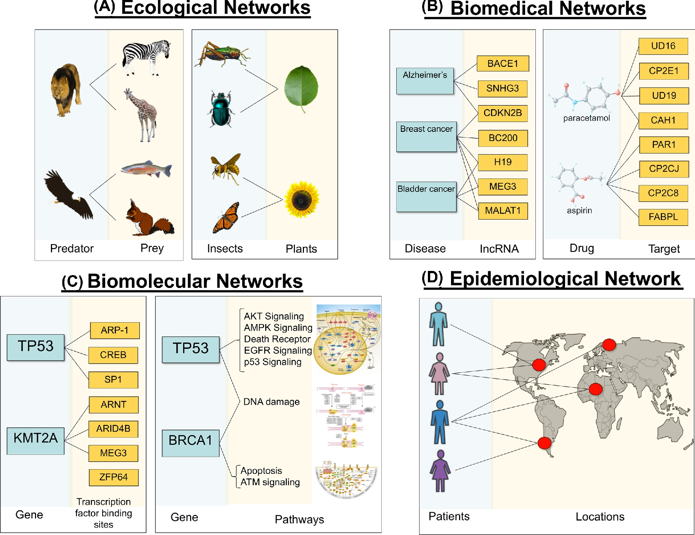 
    <figcaption>Extrait de "Bipartite graphs in systems biology and medicine: a survey of methods and applications", Gigascience, Pavlopoulos *et al.*, 2018</figcaption>
    </figure>

Parfois, un problème traite de graphe biparti sans le dire. Il existe en effet d'autres manières de parler de graphes bipartis sans les nommer. C'est ce que montre la proposition suivante.

!!! tip "Proposition"
    Soit $G = (S, A)$ un graphe non orienté, on a équivalence entre :

    1. $G$ est biparti
    2. $G$ est 2-colorable
    3. $G$ n'admet aucun cycle de longueur impaire

??? note "Démonstration"
    
    - (1) implique (2) : il suffit de colorer tous les sommets de $U$ en bleu et tous les sommets de $V$ en rouge
    - (2) implique (3) : si on considère par l'absurde un cycle de longueur impaire $(x_1, \dots, x_{n-1}, x_n = x_1)$ de $G$ qui est 2-coloré, alors par imparité, la couleur de $x_1$ est égale à celle de $x_{n-1}$ ce qui est absurde.
    - (3) implique (1) : on travaille composante connexe par composante connexe. Dans une composante connexe, on réalise un parcours de graphe en largeur depuis un sommet $x$, tous les sommets situés à distance paire de $x$ sont placés dans $U$ et ceux à distance impaire dans $V$. S'il existe un arc $st \in A$ entre $s \in U$ et $t \in V$ alors $s$ et $t$ font partie d'un cycle de longueur impaire : c'est absurde. 
   
Cette proposition nous fait aussi remarquer que les graphes acycliques (les arbres et les forêts) sont des graphes bipartis.

## 2. Couplages

!!!abstract "Définition (incidence)"
    Soit $G = (S, A)$ un graphe, si $xy \in A$ est une arête (resp. un arc) du graphe alors on dit que $xy$ est incidente au sommet $x$ (et aussi au sommet $y$)

!!!abstract "Définition (couplage)"
    Soit $G = (S, A)$ un graphe, un **couplage** $M$ est un ensemble d'arêtes (ou d'arcs) qui n'ont pas de sommets en commun, c'est-à-dire tel qu'il n'existe pas deux arêtes (ou arcs) incidentes à un même sommet.

!!!example "Exemple : couplage dans un graphe non orienté"
    Dans le graphe non orienté ci-dessous, $M = \{BH, CD, EG\}$ est un exemple de couplage, mais il y en a d'autres...
    <figure>
    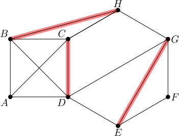 
    <figcaption>Un exemple de couplage en rouge.</figcaption>

### Cas des graphes bipartis

!!!example "Exemple : le bal"
    On considère un bal où il y a $n$ danseuses et $m$ danseurs. On construit le graphe biparti $G = (U \sqcup V, A)$ où $U$ est l'ensemble des danseuses et $V$ l'ensemble des danseurs. Dans ce graphe, il existe une arête $uv \in A$ si $u$ et $v$ sont d'accord pour danser ensemble. On voit sur cet exemple qu'un couplage est une affectation possible danseuses-danseurs où tout le monde est d'accord sur son ou sa partenaire.
    <figure>
    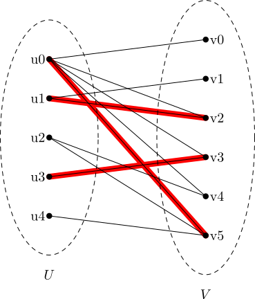 
    <figcaption>Un couplage de cardinal 3, en rouge, pour une instance du problème du bal.</figcaption>
    </figure>

Soit $G = (U \sqcup V, A)$ un graphe biparti, on suppose que les sommets de $U$ et $V$ sont numérotés : $U = \{u_0, u_1, \dots, u_{n-1}\}$ et $V = \{v_0, v_1, \dots, v_{m-1}\}$. Informatiquement un couplage $M$ peut se représenter par un tableau $T$ de longueur $n$ dans lequel :

- Si $(u_i, v_j) \in M$ alors $T[i] = j$
- Sinon $T[i] = -1$

!!!exercise "Exercice"
    1. Écrire une fonction en langage C vérifiant si un couplage représenté avec le codage proposé ci-dessus correct :
    ```c
    bool verifie(int adj[MAX][MAX], int T[MAX], int n, int m)
    ```
    Dans ce prototype `MAX` designe une constante supérieure à $n+m$ et `adj` est un tableau bi-dimensionnel stockant la *matrice d'adjacence* du graphe. On suppose que les sommets de $U$ sont les sommets numérotés de $0$ à $n-1$ et les sommets de $V$ les sommets de $n$ à $n+m-1$.
    2. Que dire du problème de décision dont l'instance est un graphe biparti et une constante entière $K$, et la question est : existe-t-il un couplage de cardinal $K$ ?

## 3. Couplages maximaux

Je donne la définition générale d'un couplage maximal mais le programme précise qu'on se place dans le cadre des graphes bipartis.

!!!abstract "Définition (couplage maximal)"
    Soit $G = (S, A)$ un graphe, un couplage $M$ est un **couplage maximal** si $\mathrm{Card}(M)$ est maximal parmi tous les couplages possibles.

On dira que $\mathrm{Card}(M)$ est la **taille du couplage**. Un couplage maximal est donc un couplage de taille maximale.

!!!example "Exemple : crise médicale"
    Une crise médicale surgit dans laquelle $n$ patients ont besoin de soins urgents et $m$ médecins sont disponibles. On construit un graphe biparti $G = (U \sqcup V, A)$ où $U$ est l'ensemble des patients, $V$ l'ensemble des médecins, et il existe un arête $(u, v) \in A$ ssi le médecin $v$ peut traiter le patient $u$. Avec cet exemple, on constate qu'un couplage est une affectation possible d'un médecin à un un patient. Un couplage **maximal** correspondra à une affectation de médecins qui maximise le nombre de patients traités.

!!!bug "Attention !"
    Un couplage peut être maximal au sens de l'inclusion sans être un couplage maximal.
    
### A - Recherche exhaustive

Soit $G = (S, A)$ un graphe.
La méthode exhaustive peut être employée pour déterminer un couplage maximal. Par exemple, on construit un arbre binaire de hauteur $|A|$ chaque profondeur représente le choix de prendre ou de ne pas prendre l'arête numéro $i$ dans le couplage. Chaque feuille de l'arbre correspond donc à une partie de $A$ : on vérifie s'il s'agit d'un couplage et conserve celui de cardinal maximum.

On peut améliorer l'exploration en élagant les branches dès que deux arêtes choisies dans le couplage sont incidentes à un même sommet. Cependant, la méthode est évidemment très coûteuse dans le pire cas : $O(2^{|A|})$ et inutilisable pour de grands graphe.

### B - Chemins augmentants

Les chemins augmentants permettent d'obtenir une méthode efficace pour la recherche d'un couplage maximal.

!!!abstract "Définition (chemin alternant)"
    Soit $G = (S, A)$ un graphe et $M$ un couplage pour ce graphe. Un chemin est dit **alternant relativement à $M$**, s'il alterne entre une arête dans $M$ et une arête n'appartenant pas à $M$.

!!!note "Remarque"
    Dans la définition de chemin alternant, l'alternance peut commencer ou non par une arête dans $M$.

!!!abstract "Définition"
    Soit $G = (S, A)$ un graphe, $M$ un couplage et $C$ un chemin dans $G$. Le chemin $C$ est dit **augmentant** pour notre couplage $M$ si :

    1. $C$ est un chemin alternant relativement à $M$
    2. $C$ commence et termine par un sommet qui n'est pas apparié dans le couplage $M$ (il n'existe pas d'arête du couplage incidente à ce sommet).


!!!note "Remarque"
    Ainsi un chemin est augmentant est un alternant qui commence et finit par un sommet non apparié. Cela implique que l'alternance commence et finit par **une arête non choisie** et que **sa longueur est impaire**. 

Dans la suite on utilisera l'opérateur de **différence symétrique** entre deux ensembles :

$$X \Delta Y = (X \cup Y) \setminus (X \cap Y)$$

Pour simplifier les notations, on confondra par abus un chemin avec son ensemble d'arêtes ce qui permettra aussi d'appliquer cet opérateur sur les chemins.

!!!tip "Proposition"
    Soit $G = (S, A)$ un graphe, $M$ un couplage de cardinal $k$ et $C$ un chemin augmentant, alors $M \Delta C$ est un couplage de cardinal $k + 1$.

!!!note "Démonstration"
    - Comme les sommets de départ et d'arrivée ne sont pas appariés et que $C$ est alternant, $C$ contient nécessairement $p$ sommets dans $M$ et $p+1$ sommets dans $\bar{M}$. Ainsi $M' = M \Delta C$ contiendra une arete de plus que $M$ (on retire $p$ arêtes et on en ajoute $p+1$, d'ou le cardinal $k + 1$. 
    - Il faut maintenant vérifier que c'est bien un couplage. Soit $(x,y)$ une arete dans $M' = M \Delta C$. 
        - Si $(x, y) \in M \setminus C$ : alors (x, y) n'est pas incidente à une autre arête $u$ de $M'$. En effet, soit $u \in M$ ce qui est exclus car $M$ est un couplage, soit $u \in C$ et alors chacune des extremités de $u$ appartiennent à un arc de $M$ qui est dans $C$ donc différent de $(x, y)$, c'est exclus car $M$ est un couplge.
        - Si $(x, y) \in C \setminus M$ : dans le chemin $C$, il apparaît le sous-chemin $(a, x, y, b)$ tel que $(a, x) \in M$,  $(x, y) \not \in M$ et $(y, b) \in M$. Soit $u$ une arête de $M'$ incidente à $x$ (par exemple) qui n'est pas dans $C$. Alors $u \in M$, c'est absurde car $u$ et $(a, x)$ seraient incidentes à un même sommet et que $M$ est un couplage. 

Cette proposition est intéressante car elle donne une méthode pour améliorer un couplage $M$ : rechercher un chemin augmentant. Tant qu'on trouve un chemin augmentant dans le graphe, on peut trouver un cardinal plus grand d'une unité. On ne sait toutefois pas encore si un couplage qui n'admet pas de chemin augmentant est bien un couplage maximal. C'est l'objet du théorème suivant.

!!!tip "Théorème (Berge)"
    Un couplage $M$ est maximal si et seulement s'il n'admet pas de chemin augmentant.

!!!note "Démonstration"
    - La proposition précédente montre le sens direct par contraposition
    - Montrons le sens réciproque : soit $G = (S, A)$ un graphe et $M$ un couplage n'admettant pas de chemin augmentant. Supposons par l'absurde que $M$ ne soit pas maximal et notons $M'$ un meilleur couplage. On considère alors $H$ le sous-graphe de $G$ dont l'ensemble des arêtes est $M \Delta M'$. Dans ce graphe un sommet ne peut être incident qu'à au plus deux arêtes : une de $M$ et une de $M'$, les composantes connexes de $H$ sont donc de trois types possibles :
        1. Un sommet isolé
        2. Un cycle alternant entre des arêtes de $M$ et de $M'$
        3. Un chemin alternant entre des arêtes de $M$ et de $M'$ de longueur impaire. 
    - Puisque $M'$ est plus grand que $M$, il en découle que $H$ contient une composante connexe possédant plus d'arêtes de $M'$ que d'arêtes de $M$. Cette composante ne peut être que du troisième type : un chemin alternant qui commence par un sommet non apparié dans $M$ et qui termine par un sommet non apparié dans $M$. Donc c'est un chemin augmentant, c'est absurde.

On obtient donc une méthode algorithmique pour construire un couplage de cardinal maximal :

1. Initialiser avec le couplage vide $M = \varnothing$
2. Tant qu'il existe un chemin augmentant $C$, faire $M \gets M \Delta C$
3. Retourner $M$

### C - Calcul des chemins augmentants avec le graphe résiduel

Dans le cas d'un graphe biparti, la recherche de chemins augmentant est facilitée. Considérons l'exemple suivant :
<figure markdown="span">

<figcaption>Un graphe biparti</figcaption>
</figure>

On souhaite calculer un chemin augmentant c'est-à-dire : qui commence par un sommet non apparié de $U$ (par exemple), qui alterne et qui termine par un sommet nécessairement dans $V$ (longueur impaire du chemin augmentant) et non apparié également. On construit pour cela **le graphe résiduel** du graphe biparti relativement au couplage $M$ actuel. C'est un graphe **orienté** construit à partir des sommets de $G$ et de $M$, en utilisant les règles suivantes :

- On ajoute un sommet de départ $s$ et un sommet cible $t$.
- Le sommet de départ $s$ pointe sur chaque sommet non apparié de $U$
- Les sommets non appariés de $V$ pointent sur le sommet cible $t$
- Si $(u, v) \in M$ on a ajoute un arc $(u, v)$ pour autoriser le passage de gauche à droite
- Si $(u, v) \not \in M$ on ajoute un arc $(v, u)$ pour autoriser le passage de droite à gauche

### 1ère itération
Voici initialement ($M = \varnothing$) le graphe résiduel de notre exemple :
<figure markdown="span">
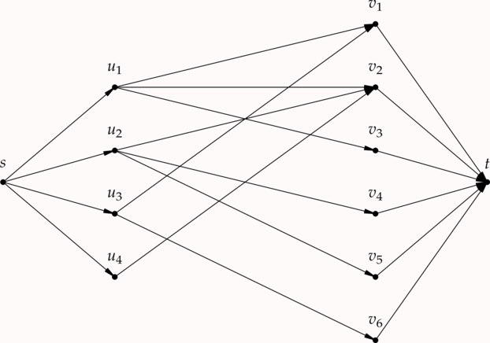
<figcaption>Graphe résiduel pour le couplage initial vide</figcaption>
</figure>

Un chemin de $s$ à $t$ correspond alors à un chemin augmentant ! En effet, il commence et termine nécessairement par des sommets non appariés, et il est bien alternant : comme le graphe est biparti, un chemin alterne avec des arcs de gauche à droite (dans $M$) et de droite à gauche (dans $\bar{M}$).

Voici un exemple de chemin de $s$ à $t$ qui correspond à un chemin augmentant dans $G$ :
<figure markdown="span">
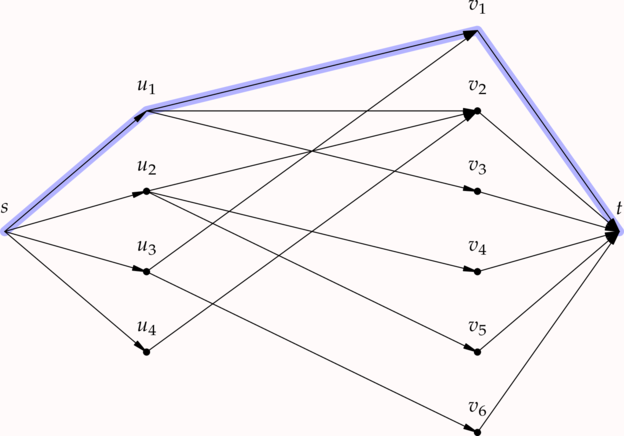
<figcaption>Un chemin augmentant</figcaption>
</figure>

Ainsi, ce chemin augmentant nous donne le nouveau couplage $M \gets M \Delta C = \{(u_1, v_1)\}$. Le graphe résiduel doit ensuite être mis à jour :
<figure markdown="span">
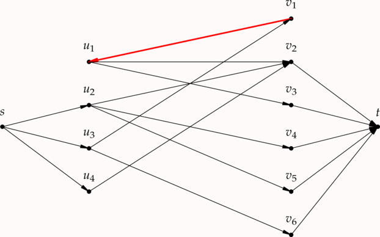
<figcaption>Mise à jour du graphe résiduel</figcaption>
</figure>

### 2e itération

On trouve maintenant le chemin améliorant
<figure markdown="span">
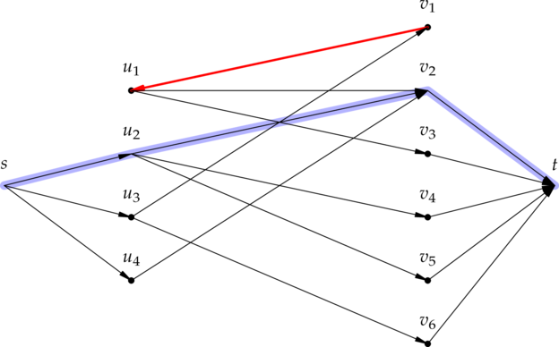
</figure>

qui conduit au couplage $M =\{(u_1, v_1), (u_2, v_2)\}$ et au nouveau graphe résiduel :
<figure markdown="span">
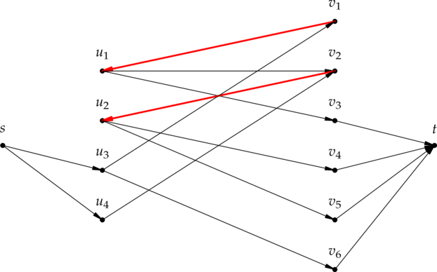
</figure>

### 3e itération

On trouve maintenant le chemin améliorant
<figure markdown="span">
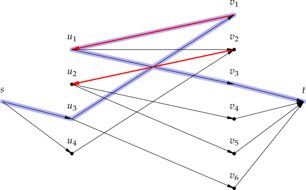
</figure>

qui conduit au couplage $M =\{(u_1, v_3), (u_2, v_2), (u_3, v_1)\}$ et au nouveau graphe résiduel :
<figure markdown="span">
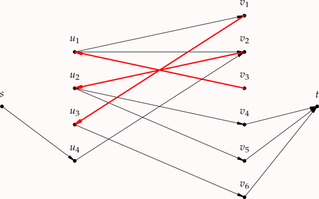
</figure>

### 4e itération

Enfin, on trouve maintenant le chemin améliorant
<figure markdown="span">
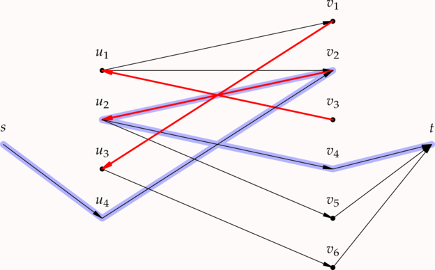
</figure>

qui conduit au couplage $M =\{(u_1, v_3), (u_2, v_4), (u_3, v_1), (u_4, v_2)\}$ et au nouveau graphe résiduel :
<figure markdown="span">
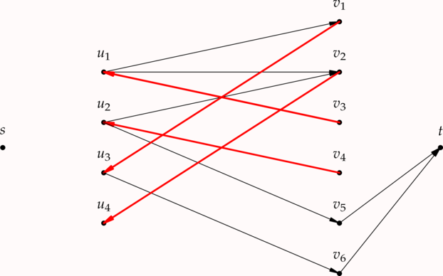
</figure>

Il n'y a maintenant plus de chemin améliorant. Le couplage obtenu est alors un couplage maximal d'après le théorème de Berge.

!!! example "Exercice"
    En appliquant l'algorithme des chemins augmentants, calculer un couplage maximal pour le graphe biparti :
    <figure>
    
    </figure>

!!!note "Complexité"
    Cet algorithme effectue au plus $|U|$ recherches de chemin augmentant. Chaque recherche est un parcours de graphe qui a une complexité $O(|U| + |V| + |A|)$ (complexité linaire). Ainsi la complexité en temps de cet algorithme est :

    $$
    O(|U|(|U| + |V| + |A|))
    $$

    Si $n = |U| + |V|$ est le nombre total de sommets alors $|A| = O(n^2)$, ce qui montre que dans le pire cas, cet algorithme est de complexité cubique $O(n^3)$.
