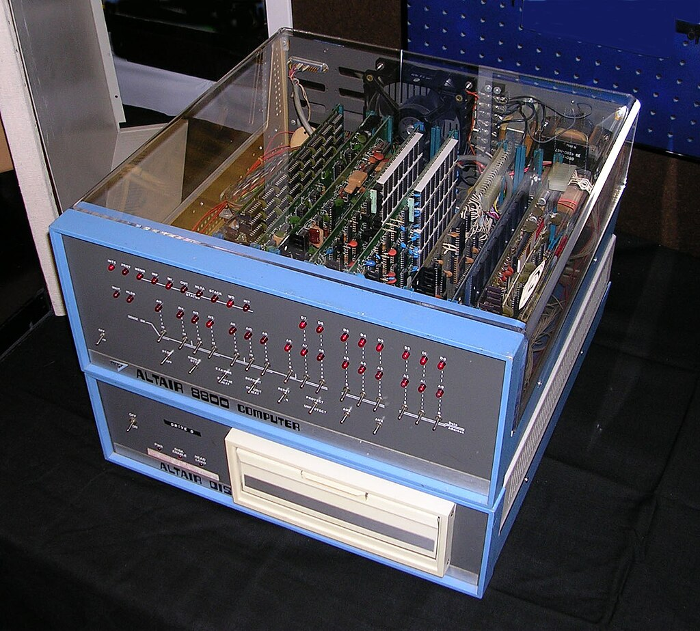

# :fontawesome-solid-microchip: Émulateur Intel 8080

Le processeur Intel 8080 est un des tous premiers processeurs grand public, conçu et fabriqué par la société Intel en 1974. Doté d'un riche jeu d'instructions (pour l'époque) et d'un bus d'adresse sur 16 bits permettant d'adresser 64kio de mémoire, il a rencontré un franc succès.

<figure markdown="span">
{width="300", align =center }
<figcaption> Le processeur Intel 8080 (Wikipedia) </figcaption>
</figure>

L' Intel 8080 a été utilisé pour la conception des premiers PC dont le plus connu est l'Altair 8080. Des versions proches du i8080, telles que le processeur Zilog Z80, ont été utlisées comme processeurs des console de jeu *GameBoy* de Nintendo (1989) et *Master System* de Sega (1985). Le successeur du Intel 8080 sera le Intel 8086 (1978) qui est le premier processeur de la famille x86. Aujourd'hui la plupart des processeurs grand public sont conçus sur l'architecture x86-64 et on retrouve dans leurs jeux d'instructions des similitudes avec l'i8080. 

-   L'Altair 8080 (1975)

    ---
    {width="300", align=center }

-   Le PC ZX Spectrum (1982)

    ---
    {width="300", align=center}

-   La console Master System (Sega)

    ---
    {width="300", align=center }

-   Le jeu *Space Invaders* sur borne d'arcade

    ---
    {width="300", align=center }

(crédits : Wikipedia)

## :white_check_mark: Objectifs

Dans ce projet en langage C, je vous propose :

- D'écrire entièrement un programme en langage C qui émule le fonctionnement du processeur i8080.
- De tester son fonctionnement en lui faisant exécuter des petits programmes écrits par nos soins en langage machine. 
- De réaliser des tests plus poussés, en faisant tourner des *vrais* programmes de diagnostique CPU, garantissant ainsi la fidélité du travail obtenu.
- D'exécuter sur notre processeur le jeu *Space Invaders* : pour cela il nous faudra aussi implémenter une émulation du matériel de la borne d'arcade du jeu.

## :woman_lifting_weights: Compétences travaillées 

Ce projet vous permettra de renforcer les compétences suivantes au programme de la MP2I/MPI :

- Programmer proprement en langage C
- Comprendre le fonctionnement d'un ordinateur dans un contexte simple (relativement aux processeurs actuels)
- Comprendre la représentation des programmes et des données en machine (base 2, entiers signés et non signés, complément à 2, chaînes de caractères, langage machine...)
- Comprendre la gestion de la mémoire d'un ordinateur : en particulier, on implémentera la fameuse **Pile** d'exécution et on comprendra son intérêt, on comprendra les notions de registre, RAM et ROM.

!!!warning "Attention"
    Les connaissances spécifiques présentées ici sur l'architecture, l'émulation matérielle et l'i8080 ne sont bien évidemment pas au programme de MP2I/MPI. Voyez ceci comme un projet pour aiguiser vos compétences et élargir votre culture en informatique.

## :link: Sources et liens utiles

Pour réaliser ce projet, je me suis basé sur les sources suivantes (mais aussi sur des lectures
de forums pour combler les manques).

- *Intel 8080 Assembly Language Programming Manual* rev. B, Intel Corp, 1975 ([disponible sur Altairclone.com](https://altairclone.com/downloads/manuals/))
- *Intel 8080 Microcomputer Systems User's Manual*, Intel Corp, 1975
- *8080/8085 Assembly language programming manual*, Intel Corp, 1981 ([disponible sur Altairclone.com](https://altairclone.com/downloads/manuals/))
- Un magnifique tableau du jeu d'instructions : [Intel 8080 instruction set](https://pastraiser.com/cpu/i8080/i8080_opcodes.html)
- [Computer archeology](https://computerarcheology.com/Arcade/SpaceInvaders/) : un site internet fantastique sur lequel des passionés ont désassemblé et commenté l'intégralité du code source assembleur du jeu *Space Invaders* 
- [ASM80.com](https://www.asm80.com/) : un éditeur en ligne magnifique permettant d'écrire, exécuter et compiler des programmes en assembleur pour i8080 (entre autres...). Merci à son auteur !
