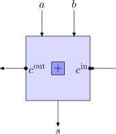
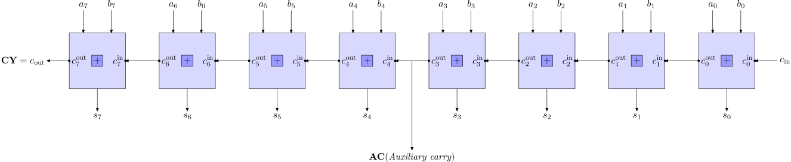

# L'unité arithmétique et logique (ALU)

**Nouveaux fichiers :** `alu.h` `alu.c`

On s'intéresse maintenant aux calculs arithmétiques et logiques réalisés par le processeur. Le 8080 est capable de réaliser :

- des additions
- des soustractions
- des ET, OR, XOR bit à bit
- des comparaisons

Toutefois plusieurs instructions permettent de réaliser chacune de ces opérations, par exemple pour additioner on dispose de **ADD**, **ADC**, **ADI** et **ACI**.
Pour éviter de réécrire plusieurs fois les mêmes codes, on rassemble dans cette unité de compilation les fonctions permettant de réaliser concrètement les opérations sur le processeur. On se servira ensuite de ces fonctions pour coder facilement chacune des instructions.


## 1. Les additions

Dans sa version la plus basique, un processeur réalise l'opération d'addition comme on l'a apprise à l'école primaire :
```
retenues :      1     1
                  1 0 0 1 0 (18)
               +  1 0 0 1 1 (19)
               ------------
                1 0 0 1 0 1 (37)
```

### Additionneur 1 bit

Pour implémenter cela, on commence par réaliser un circuit capable d'aditionner deux entiers $s = a + b$ ayant 1 bit (donc ils valent 0 ou 1)
avec éventuellement une retenue d'entrée ($c_{in}$). Cela correspond à une colonne dans le calcul ci-dessus.

Voilà à quoi ressemble schématiquement un tel composant : il possède 3 entrées $a, b, c_{in}$ et deux sorties $s, c_{out}$.

<figure markdown="span">
{width="200", align =center }
<figcaption> Additionneur 1 bit </figcaption>
</figure>


La table de vérité implémentée est la suivante :

| $a$ | $b$ | $c_{in}$ | $s$ | $c_{out}$ |
| :-: | :-: | :-: | :-: | :-: |
| 0 | 0 | 0 | 0 | 0 |
| 0 | 0 | 1 | 1 | 0 |
| 0 | 1 | 0 | 1 | 0 |
| 0 | 1 | 1 | 0 | 1 |
| 1 | 0 | 0 | 1 | 0 |
| 1 | 0 | 1 | 0 | 1 |
| 1 | 1 | 0 | 0 | 1 |
| 1 | 1 | 1 | 1 | 1 |

Par exemple si sur une colonne du calcul on trouve 1 pour $a$, 1 pour $b$ et qu'on a une retenue ($c_{in} = 1$), on obtient 11 donc on pose $s = 1$ et on retient 1 ($c_{out} = 1$).

### Additionneur 8-bits

Comment faire maintenant pour additioner des nombres $a$ et $b$ sur 8 bits (avec éventuellement une retenue d'entrée) ? Facile, il suffit d'assembler 8 additionneurs 1-bit. On fait en sorte que les retenues obtenues sur le calcul d'une colonne soit transmises à la colonne suivante. Cela donne le schéma suivant :

<figure markdown="span">
[{align =center }](add8.svg)
<figcaption> Additionneur 8 bit (cliquer pour agrandir) </figcaption>
</figure>

Dans ce circuit, il y a 3 entrées : un entier $a$ sur 8 bits, un entier $b$ sur 8 bits et un bit éventuel de retenue $c_{in}$. Les sorties sont la somme $s$ sur 8 bits et éventuellement une retenue de sortie $c_out$. Cette retenue signifie que le résultat en fait que le résultat ne tenait pas sur 8 bits et qu'il faudrait un bit supplémentaire pour le réprésenter.

Lorsque le 8080 opère une addition, il procède ainsi. De plus il signale grâce au flag **CY** s'il y a eu une retenue finale ou non (**CY** est **set** lorsque $c_{out} = 1$, sinon il est **reset**). De plus cette retenue est également utile si l'on veur sommer des entiers sur 16-bit, 24-bit, 32-bit, etc : il suffit de les voir comme 2, 3, 4, etc entiers 8-bit et de réaliser une addition par bloc de 8-bits. Le flag **CY** permettra alors de propager correctement les retenues d'un bloc à l'autre. 

On remarque aussi sur le schéma que la retenue éventuelle entre le bit 3 et 4 est aussi notifiée de la même manière que $c_{out}$ grâce au flag **AC** (retenue auxilaire). Ce flag ne sert presque à rien à part de permettre en interne l'exécution de l'instruction **DAA** qu'on expliquera plus tard. Il faudra quand même faire attention à définir **AC** correctement.

Les autres flags **S**, **Z** et **P** sont définis à partir de la valeur de sortie $s$, tel qu'on l'a programmé dans `flags.c` : on pourra utiliser la fonction `update_flags_szp`.

### Implémentation

Nous commencerons par les additions et les soustractions, on créé le fichier d'en-tête :

```c title="alu.h"
#ifndef ALU_H
#define ALU_H

#include <stdint.h>
#include "computer.h"

/* Réalise l'opération d'addition de a + b + carry et retourne le résultat.
 * carry sert à donner la possibilité d'avoir une retenue d'entrée, carry = 0 ou 1
 * op_add modifie tous les flags CY, AC, S, Z, P selon le résultat obtenu et
 * le déroulé de l'addition. */
uint8_t op_add(Computer *comp, uint8_t a, uint8_t b, uint8_t carry);

#endif
```

!!!example "Exercice"
    Dans un nouveau fichier `alu.c` implémenter l'instruction `op_add`. Je vous conseille de procéder ainsi :

    - Ajouter une assertion pour garantir que `carry` vaut 0 ou 1
    - Convertir chaque entrée en entier sur 16-bits : cela évitera les problèmes de dépassement
    - Calculer la somme `a + b + carry`
    - Si la somme dépasse le plus grand entier représentable sur 8 bits (`0xFF`) alors c'est qu'il y a une retenue (on met à jour correctement `CY`
    - Les 8 bits de poids faible de la somme correspondent à la valeur de sortie $s$ de la fonction.
    - On vérifie s'il y a une retenue auxilaire de la même manière, en vérifiant si $a' + b' + carry$ dépasse la valeur maximale sur 4 bits (`0xF`), avec $a'$ et $b'$ les entiers obtenus à partir de $a$ et $b$ en ne gardant que les 4 bits de poids faibles.
    - On n'oublie pas de mettre à jour les autres flags en fonction de la valeur de $s$

## 2. Les soustractions

Pour les soustractions on peut également procéder comme à l'école primaire :
```
                              1 0 0 1 1 (19)
                           -  0 1 1 0 0 (12)
retunues (emprunts) :      -  1 1  
                               ------------
                              0 0 1 1 1 (7)
```

La différence est surtout liée à la retenue (appelée *emprunt* dans le cas de la
soustraction) qui devra cette fois être retirée à la colonne supérieure.

Toutefois, le processeur 8080 ne procède pas ainsi : il va habilement utiliser les circuits
déjà présents (l'additionneur 8-bits) et l'astuce du complément à 2 pour réaliser sa soustraction.

### Transformer une soustraction en somme

!!! Remarque
    Cette section est construite à partir de ma compréhension des mécanismes impliqués. J'ai dû faire quelques recherches à gauche et à droite car le manuel est peu bavard sur le sujet. Par exemple pour la soustraction avec emprunt, il indique seulement :
    >The Carry bit is internally added to the contents of the specified byte. This value is then subtracted
     from the accumulator using two's complement arithmetic.

    sans préciser comment la retenue est *ajoutée en interne* ni comment est utilisé le complément à 2.

L'idée est que comme on travaille sur 8-bits ajouter $2^8$ ne change rien au résultat et donc : 
$a - b \equiv a - b + 2^8 = a + (2^8 - 1 - b) + 1$. Or $2^8 - 1 = 0b11111111$, donc soustraire $b$
à ce nombre revient à inverser les 0 et les 1 dans $b$. Au final, il suffit donc de calculer :
`a + ~b + 1`. On peut le faire avec les circuits actuels : il suffit de sommer `a` avec `~b` et d'utiliser une retenue d'entrée $c_{in} = 1$. 

Vous n'êtes pas convaincus ? Regardons sur le même exemple
```
19 = 0 0 0 1 0 0 1 1
12 = 0 0 0 0 1 1 0 0 donc ~12 = 1 1 1 1 0 0 1 1

          0 0 0 1 0 0 1 1 (19)
        + 1 1 1 1 0 0 1 1 (~12)
        +               1 (retenue à 1)
        ----------------- 
      (1) 0 0 0 0 0 1 1 1 (7)
```
Cela marche ! A ceci près que cela provoque une retenue finale **CY = 1** dans l'addition, alors qu'il n'y a pas d'emprunt final fait dans la soustraction. Pour résoudre cela, on ajoute une étape finale qui consiste **à inverser le flag CY** (on ne le fera pas pour **AC**).

A l'inverse si on effectue un résultat conduisant à une valeur négative, par exemple $19 - 25$ :
```
19 = 0 0 0 1 0 0 1 1
25 = 0 0 0 1 1 0 0 1 donc ~25 = 1 1 1 0 0 1 1 0

          0 0 0 1 0 0 1 1 (19)
        + 1 1 1 0 0 1 1 0 (~25)
        +               1 (retenue à 1)
        ----------------- 
      (0) 1 1 1 1 1 0 1 0 (250)
```
Non je n'ai pas fait d'erreur, rappelez-vous qu'on travaille ici avec des entiers non signés sur 8 bits, c'est-à-dire modulo 256. La valeur du résultat $-6$ est donc bien congrue à $256 + (-6) = 250$. Cela marche !

Remarquer que cette fois-ci il n'y a pas de retenue finale dans l'addition, et comme on va inverser **CY**, on aura au final **CY = 1** (set). Cela marque le fait que cette opération dans sa globalité a provoqué un emprunt qu'il faudra éventuellement propager dans le cas d'une soustraction par blocs.

Une autre façon de le voir est qu'en procédant ainsi pour le calcul de $a - b$, le flag CY vaudra 1 lorsque $a < b$ et 0 sinon : il sera donc très utile pour permettre de comparer deux valeurs. 

???info "En base 10 : ça marche aussi !"
    Remarquer que l'astuce du complément à 2 n'a rien de spécifique à la base 2 : si je veux calculer par exemple $124 - 012$, je peux transformer cela en addition : $124 + 987 + 1$. En effet, j'ai simplement pris le "complément à 9" de chaque chiffre de 012. On obtient : 124 + 987 + 1 = (1)112. En ignorant le premier chiffre (1 = pas d'emprunt) on retrouve bien le résultat de la soustraction !

### Et s'il y a un emprunt ?

Maintenant que se passe-t-il si l'on souhaite effectuer la soustraction $a - b$ sachant qu'il y a eu un emprûnt préalable (par exemple, si on a effectué des soustractions par bloc de 8-bits et que le bloc en dessous de nous a provoqué une retenue). Il faut donc alors calculer $a - b - 1$.

Pas de problème on refait un peu d'arithmétique : $a - b - 1 \equiv a - b - 1 + 2^8 = a + (2^8 - 1 - b)$. Autrement dit, on retrouve le même calcul que précédemment, sauf qu'on effectue l'addition sans retenue d'entrée : $c_{in} = 0$ : c'est même encore plus simple !

!!!abstract "Résumé"
    Pour conclure, on retiendra :

    - Pour calculer $a - b$ **sans emprunt** : on applique le calcul de somme `a + ~b` avec une retenue initiale `carry = 1`, puis on inverse le flag `CY` à la fin.
    - Pour calculer $a - b$ **avec un emprunt de 1** : on applique le calcul de somme `a + ~b` sans retenue initiale `carry = 0`, puis on inverse le flag `CY` à la fin

### Implémentation

Ajouter au fichier d'en-tête :
```c title="alu.h"
/* Réalise l'opération de soustraction de a - b - borrow et retourne le résultat.
 * borrow sert à donner la possibilité d'avoir une retenue d'entrée (emprunt)
 * borrow = 0 ou 1
 * op_sub modifie tous les flags CY, AC, S, Z, P selon le résultat obtenu et
 * le déroulé de la soustraction. */
uint8_t op_sub(Computer *comp, uint8_t a, uint8_t b, uint8_t borrow);
```

!!!example "Exercice"
    Dans le fichier `alu.c`, implémentez la fonction `op_sub`. Cette fonction procédera comme indiqué ci-dessus : on provoquera le bon appel à `op_add` puis on inverse le flag **CY** à la fin. C'est donc `op_add` qui détermine la valeur des autres flags.

## 3. Les opérations logiques bit à bit

On va pouvoir souffler avec quelques opérations plus simples à comprendre : le AND, le XOR et le OR bit à bit. Ce sont exactement les mêmes opérations que `&`, `^` et `|` en langage C.

Le seul point d'attention est de mettre à jour correctement les flags. Les flags **S**, **Z**, et **P** se mettent à jour normalement en fonction du résultat : on peut utiliser notre fonction `update_flags_szp` pour cela. Pour les flags **CY** (*Carry*) et **AC** (*Auxiliary Carry*), les règles sont les suivantes :

| Opération | **CY** | **AC** |
| :-: | :-: | :-: |
| AND | **reset** | défini comme le OU des deux bits 3 des opérandes |
| XOR | **reset** | **reset** |
| OR | **reset** | **reset** |

Dans l'exemple :
```
bit      7654 3210                  

         1010 1010
    AND  0110 0110
    --------------
         0010 0010
```
le flag **CY** sera **reset** (dans tous les cas), et le flag **AC** sera **set** car les bits 3 (c'est-à-dire les 4e bits en comptant de la droite vers la gauche) valent respectivement `1` et `0` et que `1 OU 0 = 1`.

!!!warning "Remarques"
    Je vous ai maché ici beaucoup de travail de recherche dans les documentations... En effet :

    Le *Intel 8080 Assembly Language Programming Manual* stipule que le flag **AC** n'est pas modifié, mais cela est contredit par d'autres sources y compris de chez Intel : le *Intel 8080 Microcomputer Systems Users Manual* indique que **AC** est affecté, mais sans dire comment. Enfin le *8080/8085 Assembly Programming Manual* explique (p 1-12) que **AC** est affecté comme expliqué ci-dessus...

    **Cet exemple doit vous rappeler à quel point la spécification et la documentation est importante en informatique**

Bon, passons à la programmation. On ajoute dans le fichier d'en-tête les prototypes pour ces trois opérations.

```c title="alu.h"
/* Ces fonctions calculent l'opération bit à bit entre a et b
 * et retournent le résultat.
 * Tous les flags : CY AC S Z P sont affectés */
uint8_t op_and(Computer *comp, uint8_t a, uint8_t b);
uint8_t op_xor(Computer *comp, uint8_t a, uint8_t b);
uint8_t op_or(Computer *comp, uint8_t a, uint8_t b);
```

!!!example "Exercice"
    Dans le fichier `alu.c`, proposer une implémentation des ces trois fonctions. On utilisera évidemment les opérateurs `&`, `^` et `|` du langage C pour effectuer les calculs.


## 4. Tester, tester et tester !

Après avoir compilé tout cela, je vous encourage sincèrement à écrire des tests unitaires fournis pour vos fonctions `op_XXX`. En particulier : vérifier non seulement la valeur du résultat, mais aussi que les flags sont correctement définis après chaque opération. Ces fonctions sont source d'erreur, en particulier sur les flags... 
