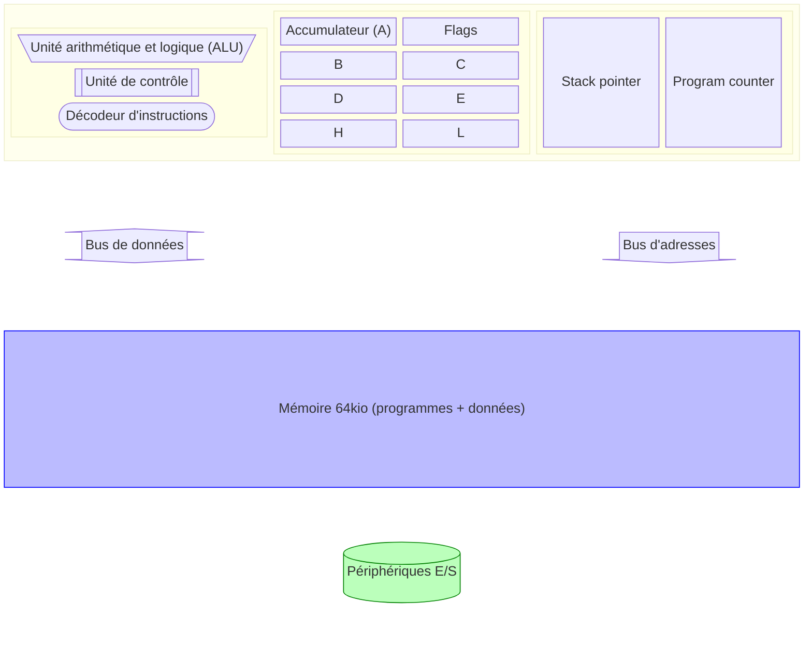
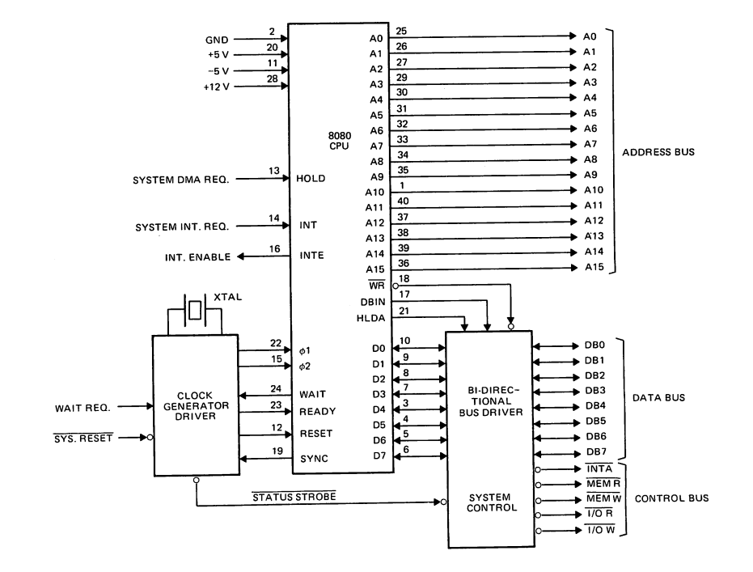

# Architecture générale du processeur

**Nouveaux fichiers :** `computer.h` `computer.c`

Commençons par présenter le processeur i8080 du point de vue de son mode de fonctionnement. Nous ne rentrerons pas dans les détails de l'architecture matérielle de ce processeur.

## 1. Composants du processeur

Voici un schéma des principaux composants d'un processeur i8080 (en jaune):



À l'interieur d'un processeur i8080, on trouve :

1. **Les registres** : Ce sont des mémoires très rapides qui servent à stocker les valeurs qui vont être manipulées par le proceseur. Ils sont au nombre de 10. Parmi ces registres, deux jouent un rôle particulier : PC qui contient l'adresse de l'instruction en cours d'exécution, et SP qui contient l'adresse du sommet de la pile d'exécution (nous expliquerons tout cela par la suite).
    - Registre A (8 bits) : ce registre particulier est appelé **accumulateur**
    - Registre B (8 bits)
    - Registre C (8 bits)
    - Registre D (8 bits)
    - Registre E (8 bits)
    - Registre H (8 bits)
    - Registre L (8 bits)
    - Registre PC *program counter* (16 bits)
    - Registre SP *stack pointer* (16 bits)
2. **L'unité arithmétique et logique (ALU)** : un ensemble de circuits qui permet d'effectuer certains calculs, l'i8080 est capable d'effectuer des additions, des soustractions, des décalages binaires, et des opérations logiques bit à bit : le AND, le OR et le XOR (ou exclusif), et c'est tout...
3. **Les flags (drapeaux)** aussi appelés *conditions* : ce sont des valeurs binaires qui servent à donner des informations sur les résultats des calculs effectués, ils sont au nombre de 5 :
    - *Sign (S)* : signe
    - *Zero (Z)* : zéro
    - *Auxiliary carry (AC)* : retenue auxiliaire
    - *Parity (P)* : parité
    - *Carry (CY)* : retenue
4. **La mémoire** : le processeur est relié à la mémoire de l'ordinateur par un **bus de données** de 8 bits et un **bus d'adresses** de 16 bits : cela signifie qu'on dispose de $2^{16}$ adresses et que chaque adresse représente 1 octet de la mémoire. Le processeur i8080 est ainsi capable de travailler avec une mémoire de 64kio. 
5. **Entrées / Sorties** : le processeur est capable d'envoyer ou recevoir un octet à un périphérique de l'ordinateur, chaque périphérique est repéré par un numéro de **port** unique codé aussi sur 8 bits, on peut donc en théorie brancher jusqu'à 256 périphériques I/O sur le processeur.
6. **Une unité de contrôle** : un composant chargé d'orchestrer l'exécution du processeur, elle contient en particulier un **décodeur** capable de lire le langage machine et déterminer quelles instructions doivent être exécutées.

Voici un autre schéma, tiré du manuel utilisateur de l'Intel 8080, qui montre comment les 40 *pins* du proceseur sont connectées avec l'extérieur. On y retrouve, l'alimentation l'électrique, le bus d'adresse, le bus de données, l'horloge (entrées $\Phi_1$ et $\Phi_2$) qui cadence le processeur à 2Mhz, et d'autres entrées/sorties de contrôle que je ne détaille pas. Toutes les connexions de la partie droite du schéma vont vers le périphérique mémoire de l'ordinateur.

<figure markdown="span">
{width="800", align =center }
<figcaption> Interface du i8080 (source : manuel Intel 8080) </figcaption>
</figure>


Avec ces informations, on peut déjà commencer par définir des types en C pour représenter un ordinateur contenant un processeur i8080.

```c title="computer.h"
#ifndef COMPUTER_H
#define COMPUTER_H

#include <stdint.h>

struct cpu_s {
    uint8_t regA;
    uint8_t regB;
    uint8_t regC;
    uint8_t regD;
    uint8_t regE;
    uint8_t regH;
    uint8_t regL;
    uint16_t pc;
    uint16_t sp;
    uint8_t flags; // Pour mémoriser les 5 flags
};
typedef struct cpu_s Cpu;

struct computer_s {
    Cpu cpu;
    uint8_t mem[65536];
};
typedef struct computer_s Computer;

extern void comp_init(Computer *comp);

#endif
```

Noter que dans un processeur 8080 réel, il n'y a pas de registre 8-bit nommé *FLAGS*. Nous décidons ici de coder l'ensemble des flags sur un octet, ce qui sera pratique quand on voudra générer le *Program Status Word (PSW)* (voir plus loin).

!!!example "Exercice"
    Écrire dans le fichier `computer.c` ci-dessous l'implémentation de la fonction `comp_init`. Cette fonction initialisera toute la mémoire de l'ordinateur à la valeur `0`. Elle initialisera le registre `PC` à la valeur `0x0000` (première adresse mémoire) et le registre `SP` à la valeur `0xFFFF` (dernière adresse mémoire).
    ```c title="computer.c"
    
    #include <stdint.h>
    #include "computer.h"

    void comp_init(Computer *comp) {
        /// A COMPLETER
    }
    ```
    On pourra tester que ce code compile avec :
    ```sh
    gcc -c computer.c
    ```


## 2. Rappels sur la représentation binaire

Vous l'aurez compris, notre émulateur va intensivement manipuler des valeurs codées sur 8 ou 16 bits et il faudra être à l'aise avec les réprésentations binaires pour s'en sortir. Je fais ici quelques rappels, en cas de doutes référez-vous à votre cours de MP2I.

Le type `uint8_t` représente une valeur entière non signée codée sur exactement 8 bits. Ainsi les valeurs possibles pour un type `uint8_t` sont :

| Base | Plus petite valeur | Plus grande valeur |
| :-: | :-: | :-: |
| 10 | `0` | $2^8 - 1$ = `255` |
| 2 | `0b00000000` | `0b11111111` |
| 16 | `0x00` | `0xFF` |

Remarquez l'utilisation du préfixe `0b` pour indiquer que la valeur littérale qui suit est codée en base 2, et le préfixe `0x` pour la base 16. Ces préfixes peuvent bien évidemment être utilisés en langage C.

Le type `uint16_t` représente une valeur entière non signée codée sur exactement 16 bits. Ainsi les valeurs possibles pour un type `uint16_t` sont :

| Base | Plus petite valeur | Plus grande valeur |
| :-: | :-: | :-: |
| 10 | `0` | $2^{16} - 1$ = `65535` |
| 2 | `0b0000000000000000` | `0b1111111111111111` |
| 16 | `0x0000` | `0xFFFF` |

La représentation hexadécimale est la plus pratique car elle est compacte tout en conservant une correspondance avec la représentation binaire : = chaque chiffre hexadécimal correspond à 4 bits de l'entier codé (ce n'est pas le cas avec la base 10...) :

| Chiffre hexadécimal | Bits | Chiffre hexadécimal | Bits |
| :-: | :-: | :-: | :-: |
| 0 | 0000 | 8 | 1000 |  
| 1 | 0001 | 9 | 1001 |
| 2 | 0010 | A | 1010 |
| 3 | 0011 | B | 1011 |
| 4 | 0100 | C | 1100 |
| 5 | 0101 | D | 1101 |
| 6 | 0110 | E | 1110 |
| 7 | 0111 | F | 1111 |

Ainsi si on veut écrire la valeur binaire 16 bits suivante : `0b1111011100010001`, il sera plus commode d'utiliser la base hexadécimale : `0xF711` 

Les valeurs de type `uint8_t` et `uint16_t` sont des entiers signés comme les autres et on peut utiliser les opérations classiques sur les entiers. Par exemple on peut écrire en C :
```c
uint8_t val = 0x1a + 0b00111110 * 2;
```
En cas de dépassement d'entier sur un calcul en `uint8_t`, tout se passe comme si on travaillait sur $\mathbb{Z}/8\mathbb{Z}$ (de même, sur $\mathbb{Z}/16\mathbb{Z}$ pour `uint16_t`). 

### Les opérateurs de décalage

En langage C, l'opérateur `<<` correspond à un décalage des bits d'un entier vers la gauche. La valeur de `n << k` est obtenue en considérant $n$ en binaire et en décalant ses bits de $k$ rangs vers la gauche. Par exemple, si on travaille sur `uint8_t` : `0b11001101 << 3` donnera `0b01101000`. Ainsi, les 3 bits les plus forts ont été perdus, tandis que 3 bits à 0 on été introduits par la droite. Mathématiquement, cela revient à multiplier par $2^k$.

De même, il existe l'opérateur `>>` qui décale les bits de la même manière (en insérant des 0) mais vers la droite. Mathématiquement calculer `n >> k` revient à effectuer la division entière de $n$ par $2^k$.

Ces opérateurs sont très utiles lorsqu'on veut lire des bits particuliers d'un nombre ou à l'inverse construire un nombre à partir de ses bits. Par exemple si on possède un entier sur 4 bits `u` (noté `uuuu` en base 2) codé sur `uint8_t` et un autre entier 4 bits `v` (noté `vvvv` en base 2) et que l'on souhaite construire l'entier qui dont les bits sont `uuuuvvvv`, on écrira tout simplement `(u << 4) + v`.

### Les opérateurs logiques bit à bit

En C, on peut utiliser les 4 opérateurs bit à bit suivants :

| Opérateur | Symbole | Syntaxe |
| :-: | :-: | :-: |
| NON bit à bit | ~ | ~x |
| ET bit à bit | & | x & y |
| OU bit à bit | \| | x \| y |
| XOR (ou exclusif) bit à bit | ^ | x ^ y |

Un opérateur bit à bit prend deux entiers `x` et `y` (un seul pour le NON) et forme un nouvel entier en appliquant la fonction logique correspondante sur les bits de la représentation en base 2 de `x` et `y`.
Par exemple, `17 & 12 = 5` car :

| bits | 7 | 6 | 5 | 4 | 3 | 2 | 1 | 0 |
| :-: | :-: | :-: | :-: | :-: | :-: | :-: | :-: | :-: |
| **21** | 0 | 0 | 0 | 1 | 0 | 1 | 0 | 1 |
| **13** | 0 | 0 | 0 | 0 | 1 | 1 | 0 | 1 |
| **5**  | 0 | 0 | 0 | 0 | 0 | 1 | 0 | 1 |

!!!absract "Utilisation de masques binaires"
    Une application particulièrement utile de l'opérateur `&`, dont on se servira pour écrire le décodeur, est l'application de **masques binaires** 

    Supposons qu'on dispose d'un entier sur 8 bits que l'on écrira `a = a7 a6 a5 a4 a3 a2 a1 a0` et qu'on ne souhaite *conserver* que les bits `a4`, `a3` et `a2`. Cela est possible en calculant : `a & 0b00011100` qui vaudra en base 2 : `0 0 0 a4 a3 a2 0 0`. La valeur `00011100` est un masque binaire qui en conjonction avec l'opérateur `&` permet de sélectionner des bits qui nous intéressent et d'annuler tous les autres.

    Une autre application intéressante est le calcul de modulo par une puissance de 2. En effet, calculer `n % 8` par exemple correspond à ne conserver que les 3 bits les plus à droite de `n` (car $8 = 2^3$). Ceci peut être calculé en temps constant par application d'un masque `n & 0x07` (car `0x07 = 0b00000111`). 

## 3. Exécution d'un programme

Le mode de fonctionnement d'un i8080 est très simple. Le programme à exécuter est codé en langage machine (binaire) dans la mémoire de l'ordinateur. Le registre PC (*program counter*) contient l'adresse mémoire de l'instruction à exécuter.

Une instruction peut être codée sur 1 octet, 2 octets ou 3 octets selon le type d'instruction. Le processeur décode l'instruction, lit le nombre d'octets nécessaires pour cela, puis l'exécute. Cela a en général pour effet de modifier les valeurs des registres et/ou des flags.

Le processeur met ensuite à jour son registre PC pour aller à l'instruction suivante en mémoire (donc selon le type d'instructions on incrémentera PC de 1, 2 ou 3).

### Langage machine et jeu d'instructions

Vous vous demandez sans doute comment le processeur fait pour savoir si l'instruction à lire est codée sur 1, 2 ou 3 octets, mais aussi comment il fait pour savoir de quelle instruction il s'agit. C'est très simple, le processeur commence par lire le premier octet (celui à l'adresse PC) et selon la valeur lue, il peut déterminer le type d'instruction.

Voici quelques exemples :

- si la valeur est `0x00`, l'instruction lue est `NOP` : l'instruction qui ne fait rien. (C'est une instruction sur 1 octet).
- si la valeur est `0xD3`, l'instruction lue est `OUT` qui signifie *envoyer le contenu du registre accumulateur sur le périphérique de sortie*. (C'est une instruction sur 2 octets, le 2e octet précise le port)
- si la valeur est `0x81`, l'instruction lue est `ADD` qui signifie *ajouter la valeur d'un registre dans l'accumulateur*, quel registre ? Pour `0x81` il s'agit du registre C. En fait plusieurs valeurs correspondent à des instructions de type `ADD` selon le registre source. De manière générale, une instruciton `ADD` a pour forme : `0x11001RRR` où `RRR` est une valeur sur 3 bits qui indique le registre à utiliser, il ya donc 8 instructions de type `ADD` et on les note souvent `ADD A`, `ADD B`, `ADD H`, etc selon la valeur à sommer.

Il y a au total environ 80 types d'instructions différentes sur un processeur 8080, c'est ce qu'on appelle son **jeu d'instructions**. Pour s'y retrouver, il faut lire attentativement la documentation :

- les manuels Intel (liens sur la page d'accueil)
- un tableau qui résume tout (mais qui ne dit pas tout) : [Intel 8080 instruction set](https://pastraiser.com/cpu/i8080/i8080_opcodes.html).

Apprenez à lire ce dernier tableau. On y retrouve beaucoup d'informations : le décodage de chaque instruction déjà, mais aussi le nombre d'octets de l'instruction, le nombre de cycles d'horloges nécessaires pour l'exécuter, les flags affectés par l'opération.

Je donne un exemple de lecture : si le premier octet d'instruction est `0x16`, on lit dans le tableau que ça correspond à la case `MVI B, d8 (2 7)`, ce qui signifie que c'est une instruction de type `MVI` sur 2 octets, qui va travailler avec le registre `B` et `d8`. `d8` signifie `data 8-bit` et représente la valeur sur le 2e octet de l'instruction. Enfin le 7 signifie que l'instruction s'exécutera en 7 cycles processeur.

Pour mener à bien notre projet d'émulation, il faudra donc déjà implémenter en C chaque opération du jeu d'instructions, puis programmer la logique d'exécution (décodage, exécution, mise à jour du PC). Cela fait beaucoup d'instructions à implémenter mais je vais vous guider.
