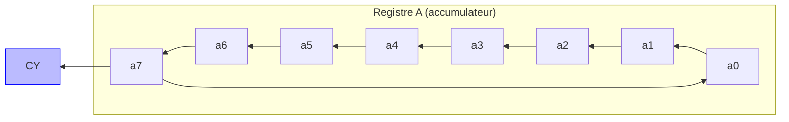
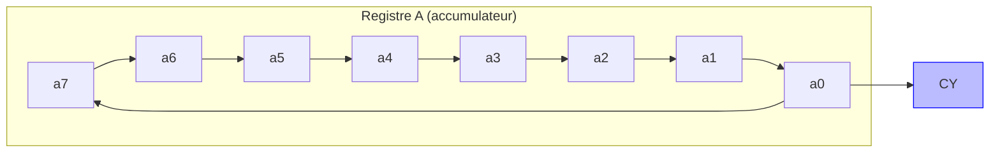
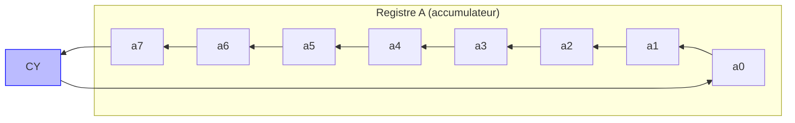
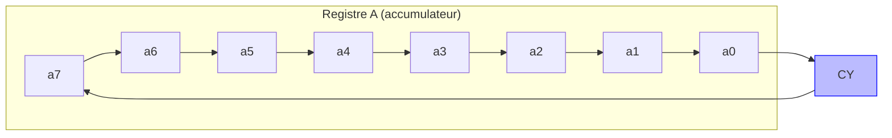

# Les instructions de décalage 

**Nouveaux fichiers :** `rotate.h` `rotate.c`

Les instructions de *décalage* sont appelées **rotations** pour le 8080 et consistent à décaler les bits du registre accumulateur vers la gauche ou la droite, à l'image des opérateurs `<<` et `>>` en langage C. Vous savez qu'en programmation, les opérateurs de décalage ont un coût constant et c'est justement grâce à l'existence de circuits dans le processeur qui les réalisent.

Sur le Intel 8080, il existe 4 instructions de décalage : **RLC** (rotate accumulator left), **RRC** (rotate accumulator right), **RAL** (rotate accumulator left through carry), **RAR** (rotate accumulator right through carry). Oui je ne me suis pas trompé dans les noms des instructions, c'est vrai qu'elles sont un peu trompeuses.

## 1. Les instructions **RLC** et **RRC**

### **RLC**

L'instruction **RLC** (*rotate accumulator left*) correspond à effectuer la rotation suivante :

Cela ressemble au `<<` du langage C, sauf que le bit de poids fort `a7` n'est pas perdu mais est déplacé en `a0`. Le flag de retenue `CY` est modifié pour prendre la valeur initiale de `a7`

Voici un exemple concret :
```
            CY  Accumulateur
avant RLC : X   11101110
après RLC : 1   11011101
```

### **RRC**

L'instruction **RRC** (*rotate accumulator right*) est similaire à **RLC** sauf qu'elle effectue le déplacement vers la droite :

Cette fois ci, le flag `CY` prend la valeur du bit de poids faible `a0`.

Par exemple :
```
            Accumulateur CY
avant RRC : 11101110     X
après RRC : 01110111     0
```

## 2. Les instructions **RAL** et **RAR**

Les instructions **RAL** (*rotate accumulator left through carry*) et **RAR** (*rotate accumulator right through carry*) effectuent des rotations vers la gauche ou la droite comme **RLC** et **RRC** sauf que le bit du flag de retenue CY est inclus dans la rotation : on fait donc tourner un mot de 9 bits.

### RAL

Voici schématiquement le fonctionnement de **RAL** :

La différence avec **RLC** est que la nouvelle valeur de `a0` est cette fois l'ancienne valeur de `CY` (et non plus l'ancienne valeur de `a7`.

Par exemple :
```
            CY  Accumulateur
avant RAL : 0   11101110
après RAL : 1   11011100
```

### RAR

De même pour **RAR**, sauf que le flag CY est placé à droite du registre A :

La différence avec **RRC** est donc que la nouvelle valeur de `a7` est cette fois l'ancienne valeur de `CY` (et non plus l'ancienne valeur de `a0`).

Par exemple :
```
            Accumulateur CY
avant RAR : 11101110     1
après RAR : 11110111     0
```

## 3. Implémentation

On ajoute le fichier d'en-tête suivant :

```c title="rotate.h"
#ifndef ROTATE_H
#define ROTATE_H

extern void instr_rlc(Computer *comp);
extern void instr_rrc(Computer *comp);
extern void instr_ral(Computer *comp);
extern void instr_rar(Computer *comp);

#endif
```

!!!example "Exercice"
    Dans un nouveau fichier `rotate.c`, écrire l'implémentation des 4 fonctions déclarées dans `rotate.h`. Comme expliqué, ces fonctions agiront sur le registre A et le flag de retenue CY.

Au risque de me répéter, à chaque nouvelle unité de compilation :

!!!example "Exercice"
    1. Mettre à jour le `Makefile` pour pouvoir compiler `rotate.o`.
    2. Ajouter dans `main.c` quelques tests unitaires (par exemple les exemples proposés ci-dessus)
    3. Re-compiler l'ensemble du projet et tester.

