# Apprentissage non supervisé

## 1. Algorithme des $k$-moyennes ($k$-means)

Se référer à la partie 2 de la présentation.

## 2. Clusterisation hiérarchique ascendante

On procède simplement de manière itérative :

- **Initialisation** : chaque point est placé de manière isolée dans chaque classe
- **Itération** : à chaque étape, on choisit les *deux clusters les plus proches* et on les fusionne.
- On continue jusqu'à ce qu'on soit satisfait du résultat (nombre de classe convenable ou distances inter-classes suffisantes)

Pour calculer la **distance** (aussi appelée **dissimilarité**) entre deux clusters, plusieurs métriques peuvent être utilisées :

- Distance de saut minimum (*Single linkage*) : $d(A, B) = \min_{x \in A, y \in B} d(x, y)$
- Distance de saut maximale (*Complete linkage*) : $d(A, B) = \max_{x \in A, y \in B} d(x, y)$
- Distance entre les barycentres : $d(A, B) = d(\mu_A, \mu_B)$
- Distance de Ward : $d(A, B) = \frac{w_Aw_B}{w_A + w_B} d(\mu_A, \mu_B)$

Cette dernière distance donne souvent de bons résultats qui minimisent la variance interclasse.

Le résultat d'un clustering ascendant hiérarchique est souvent représenté sous forme de **dendogramme** (voir exemple ci-dessous).

!!! example "Exemple : CAH avec distance minimale"
    
    Dendogramme :
    

On peut se fixer une distance inter-clusters (par exemple 2,5) et couper le dendogramme à cette hauteur : cela permet de déterminer automatiquement le nombre de classes.
