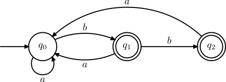
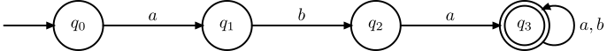
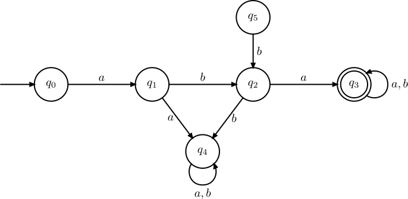
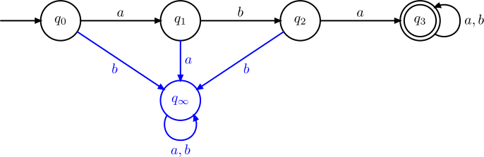
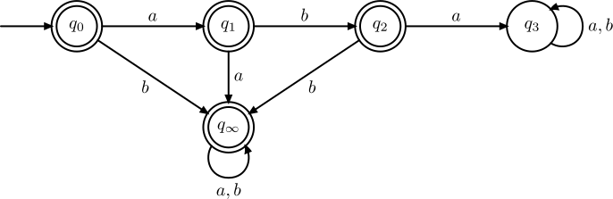

# :material-state-machine: Automates finis

Dans le chapitre sur les [langages réguliers](/langages/regexp), nous avons défini les **mots** et les **langages formels**. Nous avons décrit une certaine famille de langages appelée **langages réguliers**, qui sont décrits par un motif appelé **expression régulière**.

Une faiblesse des expressions régulières est qu'il est *a priori* difficile d'énoncer un algorithme général permettant de vérifier si un mot $u$ appartient au langage dénoté par une expression régulière. Le formalisme est expressif, facile à utiliser de notre point de vue, mais difficile à mettre en oeuvre sur une machine.

Dans ce chapitre on introduit la notion d'**automate** est qui une machine simple permettant de reconnaître des mots, et donc des langages. Contrairement aux expressions régulières, ce formalisme s'implémente facilement et efficacement sur un ordinateur.

Les automates sont aussi très importants en informatique car ils constitue un premier exemple de **machine formelle**, c'est-à-dire une représentation abstraite d'une machine capable de calculer. L'exemple le plus célèbre de machine formelle est la **machine de Turing** mais pour bien la comprendre, il faut commencer par comprendre les automates.

Dans tout ce chapitre, on se fixe un alphabet $\Sigma$ sur lequel on travaille.

## 1. Automates finis déterministes

### A. Définition

Commençons par donner une vision intuitive de la machine que nous allons construire :

- un automate est une machine qui se situe à tout moment dans un certain *état*; elle a un nombre
fini d'états possibles;
- un automate prend en entrée un mot qu'elle lit de gauche à droite, lettre par lettre;
- lorsque l'automate est dans un état $q$ et qu'il lit une lettre $c$, alors il *transite* vers un état $\delta(q, c)$ qui ne dépend que de l'état actuel $q$ et de la lettre lue $c$.

Voici la définition formelle de cette machine :

!!! abstract "Définition"
    Un **automate fini déterministe** (afd) est un quadruplet $A = (Q, q_0, F, \delta)$ où :

    - $Q$ est un ensemble **fini** d'**états**;
    - $q_0 \in Q$ est un état particulier appelé **état initial**;
    - $F \subset Q$ est un ensemble d'**états finaux**;
    - $\delta : Q \times \Sigma \to Q$ est la **fonction de transition** de l'automate.

La fonction de transition $\delta$ n'est pas nécessairement définie sur $Q \times \Sigma$ en entier, autrement dit, pour certains états $q$ et certaines lettres $c$, $\delta(q, c)$ peut ne pas être défini. Dans ce cas, on dit que l'automate **bloque** à la lecture de $c$ dans l'état $q$.

Un automate se représente plus volontier sous forme d'un *graphe orienté*, par exemple ainsi :

<figure markdown="span">

</figure>

Dans cette représentation :

- les sommets du graphe représentent les états de l'automate
- les arcs représentent les transitions, l'étiquette d'un arc est la lettre lue
- une flèche entrante marque l'état initial
- un trait double entoure les états finaux

Ainsi, dans cet exemple, l'automate représenté est $A = (Q, q_0, F, \delta)$ où :

- $Q = \{q_0, q_1, q_2\}$
- $q_0 = q_0$
- $F = \{q_1, q_2\}$
- $\delta$ est la fonction de transition que l'on peut représenter sous forme de **table de transition** de l'automate :

|état $q$ | lettre $c$ | arrivée $\delta(q, c)$ |
|:-:|:-:|:-:|
| $q_0$ | $a$ | $q_0$ |
| $q_0$ | $b$ | $q_1$ |
| $q_1$ | $a$ | $q_0$ |
| $q_1$ | $b$ | $q_2$ |
| $q_2$ | $a$ | $q_0$ |

!!! info "Remarque"
    Dans certains textes, les états finaux peuvent être marqués par une flèche sortante plutôt qu'un trait double.

### B. Calcul d'un automate

Nous avons défini formellement un automate et il nous reste maintenant à décrire son fonctionnement c'est-à-dire décrire comment cette machine *calcule*.

Un automate est une machine capable de *lire des mots*. Lorsque l'automate est dans un état $q_1$ et que l'on lit une lettre $c$, l'automate transitionne vers l'état $q_2 = \delta(q, c)$ (sauf s'il y a blocage). Pour tout état $q_1$ et $q_2$ et toute lettre $c \in \Sigma$, on notera :

$$
q_1 \longrightarrow^c q_2
$$

lorsque $q_2 = \delta(q_1, c)$.

!!! info "Notation alternative"
    Il est aussi possible de noter $q_1.c = q_2$ lorsque $\delta(q_1, c) = q_2$.

!!! abstract "Définition (calcul)"
    Un **calcul** d'un automate fini déterministe $A = (Q, q_0, F, \delta)$ est un chemin dans l'automate, c'est-à-dire une suite d'états :

    $$
    u_0 \longrightarrow^{w_1} u_1 \longrightarrow^{w_2} u_2 \longrightarrow^{w_3} \cdots \longrightarrow^{w_{n-1}} u_{n-1} \longrightarrow^{w_n} u_n
    $$

    où les $w_i$ sont des lettres lues et qui vérifie bien :

    $$
    \forall k \in \{0, \dots, n-1\}, u_{k+1} = \delta(u_k, w_k).
    $$

!!! example "Exemple (calcul d'un automate)"
    Dans l'automate :
    <figure>
    
    </figure>
    
    $$
    q_0 \longrightarrow^a q_0 \longrightarrow^b q_1 \longrightarrow^b q_2 \longrightarrow^a q_0 \longrightarrow^b q_1
    $$

    est un calcul de l'automate qui correspond à la lecture du mot $abbab$ depuis l'état $q_0$ et qui mène en $q_1$.

On remarque que pour un état de départ $q$, et un mot $u$ donné, il ne peut exister qu'un seul calcul depuis cet état, c'est pour cette raison que l'on dit que l'automate est **déterministe** : il n'a qu'un seul comportement possible à la lecture d'un mot en entrée. Cela peut être rendu explicite par la définition de la *fonction de transition étendue* :

!!! abstract "Définition (fonction de transition étendue)"
    Soit $A = (Q, q_0, F, \delta)$ un automate fini déterministe. On définit la **fonction de transition étendue** $\delta^* : Q \times \Sigma^* \to Q$ par :

    $$
    \begin{cases}
    \forall q \in Q,\ \delta^*(q, \varepsilon) = q  \\
    \forall q \in Q, \ \forall u \in \Sigma^*, \ \forall c \in \Sigma, \ \delta^*(q, uc) = \delta(\delta^*(q, u), c) \\
    \end{cases}
    $$

Ainsi, la fonction $\delta^*$ étend la fonction $\delta$ aux mots. Tout comme la fonction $\delta$, elle n'est pas forcément définie sur $Q \times \Sigma^*$ : la lecture d'un mot peut provoquer un blocage.

!!! info "Notations alternatives"
    Il est aussi possible de noter :

    - $q_1.u = q_2$ 
    - ou encore $q_1 \rightarrow^u q_2$

    lorsque $\delta^*(q_1, u) = q_2$. La première notation, plus mathématique, montre qu'on peut faire *agir* le monoïde $\Sigma^*$ sur l'ensemble d'états $Q$. La seconde notation met en évidence la notion de chemin dans l'automate.


### C. Langage reconnu

!!!abstract "Définition (mot reconnu)"
    Soit $A = (Q, q_0, F, \delta)$ un automate fini déterministe. Un mot $u \in \Sigma^*$ est **reconnu** (on dit aussi **accepté**) par $A$ lorsque $\delta^*(q_0, u) \in F$.

Autrement dit, un mot est reconnu est par un automate si sa lecture à partir l'état initial $q_0$ :

1. ne provoque pas de blocage 
2. mène l'automate dans un de ses états finaux

!!!abstract "Définition (langage reconnu)"
    Soit $A = (Q, q_0, F, \delta)$ un automate fini déterministe. Le **langage reconnu** (aussi appelé **langage accepté**) par l'automate $A$, noté $\mathcal{L}(A)$ est :

    $$
    \mathcal{L}(A) = \{ u \in \Sigma^*, \delta^*(q, u) \in F \}
    $$

Autrement dit, le langage reconnu est l'ensemble des mots reconnus par l'automate.

!!!abstract "Définition (langage reconnaissable)"
    - Un langage $L$ est dit **reconnaissable par automate fini** s'il existe un automate fini déterministe $A$ tel que $\mathcal{L}(A) = L$.
    - L'ensemble des langages sur $\Sigma$ reconnaissables par automate fini est appelé **classe des langages reconnaissables**. Elle sera notéee $\def\rec#1{{\text{REC}(#1)}} \rec{\Sigma}$ dans ce cours.

Étudions maintenant quelques exemples de langages pouvant être reconnus par automate fini déterministe.

!!!example "Exemple : mots commençant par ..."
    On souhaite reconnaître par automate le langage des mots sur $\Sigma = \{a, b\}$ qui commencent par $aba$, c'est-à-dire ayant $aba$ pour préfixe. Pour cela, on peut proposer l'automate suivant :
    <figure>
    
    </figure>
    La dernière flèche, tout à droite, est étiquetée par $a, b$, ce qui signifie qu'il y a en réalité 2 transitions. On utilise souvent cette notation pour alléger les figures.
    L'automate peut se lire en deux parties :

    - Une première phase où on lit le préfixe $aba$, remarquer comme on utilise le **blocage** pour rejeter les mots qui ne commencent pas par $aba$
    - Une seconde phase où on boucle sur l'état final, ce qui signifie qu'on accepte maintenant toute suite de lettres

!!!example "Exemple : mots contenant un nombre impair de $a$"
    On souhaite reconnaître par automate le langage des mots sur $\Sigma = \{a, b\}$ contenant un nombre impair de $a$. Pour cela, on peut proposer l'automate suivant :
    <figure>
    
    </figure>
    Dans cet exemple, les états de l'automate servent à reprensenter les classes de congruence du nombre de $a$ modulo 2. Plus simplement, dans l'état $q_0$ le nombre de $a$ lus est pair et dans l'état $q_1$ le nombre de $a$ lus est impair. Cela explique que la lecture d'un $a$ fait passer d'un état à l'autre, tandis que la lecture d'un $b$ ne change pas l'état.

!!!note "Conseil"
    Autant que possible, faites en sorte que chaque état de l'automate ait une signification propore comme dans les exemples précédents. Cela facilite à la fois la conception et la justification de l'automate.

!!!example "Exercice"
    En vous inspirant de l'exemple précédent, proposer un automate pour reconnaître les mots sur $\Sigma = \{a, b\}$ dont le nombre de $b$ est de la forme $3k + 1$ avec $k \in \mathbb{N}$.

### D. Programmation

Nous avions promis que les automates étaient bien plus simples à mettre en oeuvre sur un ordinateur que les expressions régulières. Voici donc un exemple d'implémentation en OCaml.

```ocaml
    type etat = int;; (* Les etats sont representes par des numeros de 0 à |A|-1*)

    type auto = {
        taille: int; (* nombre d'états *)
        init: etat;
        final: etat list;
        trans: (char * etat) list array; (* table de transitions *)
    };;
```

Le seul point délicat de cette représentation est la *table de transitions*, c'est-à-dire la manière dont on représente la fonction de transition $\delta$.
La représentation choisie est un tableau `trans` dans lequel chaque case `trans.(i)` contient les transitions sortantes de l'état $i$.
Ces transitions sont représentées sous forme d'une liste de couples $(c, j)$ où $c$ est la lettre lue et $j$ l'état d'arrivée de la transition. 
Cette représentation est analogue à celle des **listes d'adjacence** pour les graphes orientés.

!!!note "Remarque"
    Ces listes sont appelées **listes associatives**. Elles servent à associer un état d'arrivée (valeur) à une lettre lue (clef). Autrement dit il s'agit d'une implémentation concrète de la structure de données abstraite de **dictionnaire**. On a choisi les listes associatives par simplicité mais nous aurions aussi pu utiliser une **table de hachage** ou encore un **arbre binaire de recherche**.

!!!example "Définition d'un automate"
    Définissons en OCaml l'automate vu en début de chapitre :
    <figure>
    
    </figure>
    ```ocaml
    let a1 = {
        taille = 3;
        init = 0;
        final = [1; 2];
        trans = [|
            [('a', 0); ('b', 1)]; (* transitions sortantes de l'etat 0 *)
            [('a', 0); ('b', 2)];
            [('a', 0)]
        |]
    };;
    ```

Un avantage de l'utilisation des listes associatives est que la fonction `List.assoc` est déjà programmée pour vous dans la bibliothèque OCaml (sa programmation ne devrait poser aucun problème, faites-le en exercice). Cette fonction a pour signature `List.assoc : 'a -> ('a * 'b) list -> 'b'`, elle prend en argument une *clef* et une liste associative et renvoie la valeur associée à cette clef. Si la clef n'existe pas dans la liste, alors l'exception `Not_found` est levée.

Pour nous, les clefs sont les lettres lues, les valeurs les états d'arrivée et l'exception `Not_found` est déclenchée lorsqu'il y a blocage. Implémentons la fonction de calcul d'un automate :
```ocaml
(* lit le mot u dans auto depuis l'etat q *)
let calcul auto q u =
    let n = String.length u in (* le mot est une chaîne de caractères *)
    let etat_courant = ref q in (* on se sert d'une référence pour mémoriser l'état courant *)
    for i = 0 to n-1 do
        let nouvel_etat = List.assoc u.[i] auto.trans.(!etat_courant) in
        etat_courant := nouvel_etat
    done;
    !etat_courant
;;
```
Remarquons que cette fonction lève aussi l'exception `Not_found` en cas de blocage. Nous pouvons maintenant programmer la fonction
qui teste si un mot est accepté ou non par un automate :
```ocaml
let est_reconnu auto u =
    try
        (* on calcule l'etat d'arrivée en fin de lecture du mot *)
        let etat_fin = calcul auto auto.init u in
        (* on teste s'il est final *)
        List.mem etat_fin auto.final
    with
        (* Si Not_found est levé, il y a blocage, le mot n'est pas accepté *)
        Not_found -> false 
;;
```

!!!note "Les automates sont efficaces !"
    Les automates se programment assez rapidement mais surtout ils sont efficaces. La lecture d'un mot $u$ est de complexité linéaire $O(|u|)$. Encore mieux, l'automate lit en fait une et une seule fois chaque lettre de gauche à droite.

## 2. Opérations classiques sur les automates

### A. Accessibilité et émondage

!!!abstract "Définition (accessibilité)"
    Soit $A = (Q, q_0, \delta, F)$ un automate fini déterministe et $q \in Q$ un état.

    - On dit que $q$ est **accessible** s'il existe un mot $u$ tel que $q_0 \rightarrow^u q$
    - On dit que $q$ est **co-accessible** s'il existe un mot $u$ et un état final $q_F \in F$ tels que $q \rightarrow^u q_F$

!!!note "Remarque : un état utile est accessible et co-accessible"
    - Un état qui n'est pas accessible n'est jamais atteint lors d'un calcul depuis l'état $q_0$, il est donc inutile.
    - Un calcul qui atteint un état qui n'est pas co-accessible n'aboutira jamais à un état final. 

Le calcul des états accessibles peut s'obtenir simplement en réalisant un parcours de graphe depuis l'état $q_0$, en igonorant les étiquettes des transitions. 

Le calcul des états co-accessibles peut s'obtenir de la même manière, en inversant le sens des transitions et en exécutant un parcours à partir de chaque état final.

!!!tip "Proposition"
    Soit $L$ un langage reconnaissable par automate fini déterministe, alors il existe un automate fini déterministe $A$ qui reconnaît $L$ et dont tous les états sont accessibles et co-accessibles.

???note "Démonstration"
    Il suffit de calculer tous les états accessibles et co-accessibles d'un automate reconnaissant $L$, puis de lui supprimer les états qui ne le sont pas. Ce faisant, on supprime bien sûr les transitions qui partent ou qui pointent d'un état supprimé. Comme un calcul réussi passe nécessairement par des états accessibles et co-accessibles, cela ne change pas le langage reconnu par l'automate.

!!!info "Vocabulaire"
    Lorsqu'on élimine les états non accessibles et non co-accessibles d'un automate, on dit qu'on **émonde** cet automate.

!!! example "Exemple"
    Considérons l'automate :
    <figure>
    
    </figure>
    Les états **accessibles** sont : $q_0, q_1, q_2, q_3, q_4$

    Les états **co-accessibles** sont $q_0, q_1, q_2, q_3, q_5$

    Les états $q_4$ et $q_5$ sont donc inutiles.

    Si on émonde l'automate on obtient :
    <figure>
    
    </figure>


### B. Complétion d'un automate

!!!abstract "Définition (automate complet)"
    Soit $A = (Q, q_0, \delta, F)$ un automate fini déterministe. On dit que cet automate est **complet** lorsque $\delta(q, c)$ est défini pour tout état $q \in Q$ et toute lettre $c \in \Sigma$.

Dans un automate complet, il n'y a jamais de blocage.

!!!tip "Proposition"
    Soit $L$ un langage reconnaissable par automate fini déterministe, alors il existe un automate fini déterministe **complet** $A$ qui reconnaît $L$.

???note "Démonstration"
    Soit $A = (Q, q_0, \delta, F)$ un automate qui reconnaît $L$ et qui n'est pas déjà complet. On construit l'automate $A' = (Q', q_0, \delta', F)$ avec $Q' = Q \cup \{q_\infty\}$ où $q_\infty$ est un nouvel état ($q_\infty \not \in Q$.) appelé *état puits*. On définit $\delta'$ ainsi :

    $$
    \forall q \in Q',\ \forall c \in \Sigma, \delta'(q, c) =
    \begin{cases}
    \delta(q, c) & \text{si c'est défini}\\
    q_\infty & \text{sinon}
    \end{cases}
    $$

    Alors $A'$ est complet et de plus $\mathcal{L}(A) = \mathcal{L}(A')$. En effet :

    - si $u \in \mathcal{L}(A)$ alors il existe un calcul dans $A$ étiqueté par $u$ mentant de l'état $q_0$ à un état final. Ce calcul existe donc aussi dans $A'$, donc $u \in \mathcal{L}(A')$.
    - réciproquement, si $u \in \mathcal{L}(A')$ alors il existe un calcul dans $A'$ étiqueté par $u$ menant de l'état $q_0$ à un état final. Comme $q_\infty$ n'est pas co-accessible, ce calcul ne passe pas par $q_\infty$ et c'est donc aussi un calcul dans $A$, donc $u \in \mathcal{L}(A)$.

!!!note "Point méthode"
    Pour compléter un automate (qui n'est pas déjà complet) :

    1. On ajoute un état puits $q_\infty$
    2. Pour tout état, on ajoute toutes les transitions sortantes manquantes, en les faisant pointer vers $q_\infty$
    3. On n'oublie pas de réaliser l'étape 2 aussi pour l'état puits $q_\infty$

!!!example "Exemple"
    Soit l'automate suivant sur $\Sigma = \{a, b\}$ qui n'est pas complet:
    <figure>
    
    </figure>

    En appliquant l'algorithme de complétion, on obtient :
    <figure>
    
    </figure>


!!!warning "Attention"
    On peut émonder un automate, on peut compléter un automate, mais on ne peut pas toujours faire les deux opérations à la fois puisque l'état puits que l'on ajoute dans la complétion n'est pas co-accessible.


### C. Automate complémentaire

Soit $\Sigma$ un alphabet et $L$ un langage, on note $\bar{L} = \{u \in \Sigma^*, u \not \in L\}$ le **langage complémentaire** de L.

!!!tip "Proposition"
    Si $L$ est un langage reconnaissable par automate fini déterministe alors $\bar{L}$ l'est aussi.

???note "Démonstration"
    Soit $L$ un langage reconnu par l'automate fini déterministe $A$.
    On donne un algorithme pour construire un automate fini déterministe $A'$ qui reconnaît $\bar{L}$.

    - On commence par compléter l'automate $A$ et on obtient un automate complet $A_c = (Q, q_0, \delta, F)$ qui reconnaît $L$.
    - On construit alors $A'$ en inversant les états finaux et non finaux dans $A_c$ c'est-à-dire que $A_c = (Q, q_0, \delta, Q \setminus F)$.

    On a alors $\mathcal{L}(A') = \bar{L}$, en effet pour tout $u \in \Sigma^*$:

    $$
    \begin{align}
    u \in \mathcal{L}(A') & \Leftrightarrow \delta^*(q_0, u) \in Q \setminus F \\
    & \Leftrightarrow \delta^*(q_0, u) \not \in F \\
    & \Leftrightarrow u \not \in \mathcal{L}(A_c) \quad \text{ car } A_c \text{ est complet} \\
    & \Leftrightarrow u \not \in \mathcal{L}(A) \\
    & \Leftrightarrow u \not \in L\\
    & \Leftrightarrow u \in \bar{L}
    \end{align}
    $$

Dans la démonstration, on remarque l'importance de compléter l'automate : cela permet de n'avoir qu'une seule cause de non non-accceptation à savoir le fait que la lecture du mot aboutit dans un état non final.

!!!note "Point méthode"
    Pour construire un automate fini déterministe $A'$ reconnaissant le complémentaire de $\mathcal{L}(A)$, on applique les étapes :

    1. On complète $A$
    2. On inverse les états finaux et non finaux

!!!example "Exemple : mots qui ne commencent pas par $aba$"
    Soit l'automate suivant sur $\Sigma = \{a, b\}$ reconnaissant les mots qui commencent par $aba$ :
    <figure>
    
    </figure>

    On souhaite construire l'automate complémentaire c'est-à-dire un automate qui reconnaît les mots qui ne commencent pas par $aba$.
    On commence par compléter l'automate : 
    <figure>
    
    </figure>

    Puis, on inverse les états finaux et non finaux :
    <figure>
    
    </figure>

Encore une fois, on peut constater sur l'exemple que l'oubli de l'étape de complétion donne un automate complémentaire faux.

### D. Automate produit

## 3. Automates finis non déterministes

## 4. Automates finis non déterministes à transitions spontanées

## 5. Langages non reconnaissables par automate

Il existe des langages qui ne peuvent pas être reconnus par un automate fini. Le théorème suivant permet de démontrer que certains langages ne sont pas reconnaissables.

!!!tip "Théorème (Lemme de l'étoile)"
    Soit $L$ un langage reconnu par un automate à $N$ états. Soit $u \in L$ un mot de longueur $|u| \geq N$, alors il existe 3 mots $x, y, z \in \Sigma^*$ tels que $u$ se décompose en $u = xyz$ et vérifiant :

    1. $|xy| \leq N$
    2. $y \neq \varepsilon$
    3. $\forall k \in \mathbb{N},\  xy^kz \in L$

???note "Démonstration"
    Soit $L$ un langage reconnu par un automate $A = (Q, q_0, F, \delta)$ à $N$ états et $u \in L$ un mot de longueur $|u| \geq N$.
    Notons $p_k$ ($0 \leq k \leq N$) le préfixe de $u$ de longeur $k$. On considère l'application
    
    $$
    \begin{align}
    \varphi : [|0, N|] &\to Q \\
    k &\mapsto \delta^*(q_0, p_k)\\
    \end{align}
    $$

    Remarquons que cette application est bien définie, car $u$ est reconnu par $A$ donc il n'y a pas de blocage à la lecture des préfixes de $u$.

    Comme $\text{Card}([|0, N|]) = N+1$ et $\text{Card}(Q) = N$, l'application $\varphi$ n'est pas injective. Il existe donc deux entiers $0 \leq k_1 < k_2 \leq N$ tels que $\varphi(k_1) = \varphi(k_2)$. Informellement, cela signifie que la lecture de $u$ depuis l'état $q_0$ va conduire au passage par un même état à deux instants $k_1$ et $k_2$ distincts. Notons $q' = \varphi(k_1)$ cet état qui est visité au moins deux fois.

    On pose alors $x = p_{k_1}$, $y$ tel que $xy = p_{k_2}$ et $z$ tel que $xyz = u$. On a alors $\delta^*(q_0, x) = \delta^*(q_0, xy) = q'$. Vérifions que cette décomposition fonctionne :
    
    1. $|xy| = |p_{k_2}| = k_2 \in [|0, N|]$
    2. Si $y = \varepsilon$ alors $x = xy$ ce qui implique $k_1 = k_2$, c'est exclus.
    3. On montre par récurrence sur $k$ que $\delta^*(q_0, xy^kz) = \delta^*(q_0, u)$ ce qui montre que $xy^kz$ est reconnu car $u$ l'est.

        a. **Initialisation** : $\delta^*(q_0, xz) = \delta^*(\delta^*(q_0, x), z) = \delta^*(q', z) = \delta^*(\delta^*(q_0, xy), z) = \delta^*(q_0, xyz)$

        b. **Hérédité** : on suppose la propriété vraie au rang $k \in \mathbb{N}$, montrons-là au rang $k+1$ :

        $$
        \begin{align}
        \delta^*(q_0, xy^{k+1}z) &= \delta^*(\delta^*(\delta^*(q_0, xy), y^k), z) = \delta^*(\delta^*(q', y), z) \\
        &= \delta^*(\delta^*(\delta^*(q_0, x), y^k), z) = \delta^*(q_0, xy^kz)\\
        &= \delta^*(q_0, xyz) \text{ par hypothèse de récurrence}
        \end{align}
        $$

Savoir démontrer qu'un langage n'est pas reconnaissable ne s'improvise pas et il faut étudier attentivement les méthodes permettant d'obtenir ce résultat.

!!!note "Point méthode : démontrer qu'un langage $L$ n'est pas reconnaissable avec le lemme de l'étoile"
    
    1. On suppose par l'absurde que $L$ est reconnu par un automate à $N$ états.
    2. On **choisit** judicieusement un mot $u \in L$ particulier de longueur $|u| \geq N$
    3. On invoque le Lemme de l'étoile ce qui nous permet d'obtenir la décompostion $u = xyz$.
    4. À l'aide des propriétés (1), (2) et (3) du lemme de l'étoile, on aboutit à une absurdité.

!!!example "Exemple clé : $\{a^n b^n, n \in \mathbb{N}\}$"
    Démontrons que langage $L = \{a^nb^n, n \in \mathbb{N}\}$ n'est pas reconnaissable.

    1. Supposons par l'absurde que $L$ soit reconnaissable et qu'il est reconnu par un automate à $N$ états.
    2. Considérons le mot $u = a^N b^N$, alors $u \in L$ et $|u| = 2N \geq N$.
    3. D'après le lemme de l'étoile, il existe donc 3 mots $x, y, z \in \mathbb{N}$ tels que
        1. $|xy| \leq N$
        2. $y \neq \varepsilon$
        3. $\forall k \in \mathbb{N},\ xy^kz \in L$
    4. D'après (a), $x$ et $y$ ne contiennent que des lettres $a$. De plus, d'après (b), $y$ contient au moins un $a$. D'après (c), on doit avoir $|xy^kz|_a = |xy^kz|_b$ pour tout $k \in \mathbb{N}$ car les mots de $L$ contiennent autant de $a$ que de $b$. Ceci est absurde, car d'après nos remarques :

    $$
    |xy^kz|_a = |x|_a + k\underbrace{|y|_a}_{> 0} + |z|_a
    $$

    $$
    |xy^kz|_b = |x|_b + |y^k|_b + |z|_b = |z|_b
    $$

    La première quantité croît **strictement** lorsque $k$ croît tandis que la seconde reste constante. C'est absurde. Donc $L$ n'est pas reconnaissable.

!!!note "Point méthode : démontrer qu'un langage $L$ n'est pas reconnaissable en utilisant les propriétés de clôture"
    Pour utiliser cette méthode, il faut exploiter un langage $L_2$ dont on sait déjà qu'il n'est pas reconnaissable (hypothèse de l'énoncé ou on l'a démontré avant).

    1. On suppose par l'absurde que $L$ est reconnaissable.
    2. On montre que $L_2$ peut s'obtenir à partir de $L$ et d'autres langages reconnaissables en utilisant des opérations qui préservent le caractère reconnaissable (complémentaire, intersection finie, union finie, ...)
    3. On en déduit que $L_2$ est reconnaissable : c'est absurde.

!!!example "Exemple clé : $\{ u \in \{a,b\}^*, |u|_a = |u|_b \}$"
    Montrons que $L = \{ u \in \{a,b\}^*, |u|_a = |u|_b \}$ n'est pas reconnaissable. On sait que le langage $L_2 = \{a^n b^n, n \in \mathbb{N} \}$ n'est pas reconnaissable (exemple précédent).

    1. Supposons par l'absurde que $L$ est reconnaissable.
    2. On pose $K$ le langage dénoté par $a^*b^*$, il est reconnaissable (il est facile de proposer un automate).
    On remarque de plus que $L \cap K = L_2$.
    3. Comme l'**intersection** de deux langages reconnaissable est reconnaissable, on en déduit que $L_2$ est reconnaissable : c'est absurde.

Cette seconde méthode, quand on peut l'appliquer, permet de gagner du temps en évitant d'invoquer le lemme de l'étoile. La lectrice pourra vérifier qu'on peut aussi résoudre ce deuxième exemple en utilisant la première méthode.

!!!bug "Raisonnements faux usuels"
    On retrouve souvent les raisonnements **faux** suivants :

    1. *Une sous-partie d'un langage non reconnaissable est non reconnaissable* : $L \subset L'$ avec $L'$ non reconnaissable donc $L$ est non reconnaissable.
    2. *Si je contiens une partie non reconnaissable alors je suis non reconnaissable* : $L' \subset L$ avec $L'$ non reconnaissable donc $L$ est non reconnaissable.

    Dans le premier cas, cela montrerait par exemple que $\varnothing$ n'est pas reconnaissable.
    Dans le second cas, si on prend $L = \Sigma^*$ on obtiendrait que $\Sigma^*$ n'est pas reconnaissable. 

    **A RETENIR :** les raisonnements par inclusion sont faux dans ce contexte
