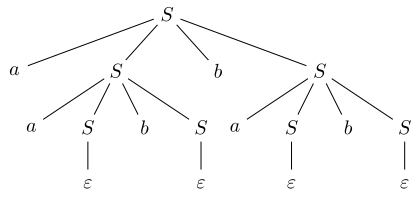
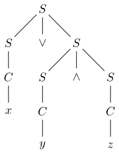

# Grammaires algébriques

Nous avons déjà étudié les expressions régulières et les automates finis qui permettent de décrire certains langages appelés langages réguliers. Nous avons aussi vu que tous les langages ne sont pas réguliers, en particulier certains langages utiles en informatique comme les langages de mots bien parenthésés ne sont pas régulier.

On s'intéresse donc dans ce chapitre à une nouvelle manière de décrire des langages à l'aide de grammaires.

## 1. Grammaires algébriques

Dans ce cours on notera en général :

- $\Sigma$ un alphabet fini de symboles appelés **symboles terminaux**
- $V$ un alphabet fini de symboles appelés **variables** ou **symboles non terminaux**

!!! abstract "Définition"
    Une **grammaire algébrique** est un quadruplet $(\Sigma, V, S, \mathcal{R})$ dans lequel :

    * $\Sigma$ est l'alphabet des **symboles terminaux**
    * $V$ est l'alphabet des **symboles non terminaux** ou **variables**
    * $S \in V$ est un non terminal spécial appelé **axiome** ou **symbole de départ**
    * $\mathcal{R}$ est un ensemble _fini_ de **règles de production** : une règle de production est un couple $(X, u)$ où $X$ est une variable et $u$ un mot sur $\Sigma \cup V$.

Une règle de production $(X, u)$ sera notée $X \to u$. $X$ est le **membre gauche** de la règle et $u$ le **membre droit**.

Lorsqu'une grammaire possède plusieurs règles avec même membre gauche on peut condenser l'écriture de ces règles ainsi : $X \to u \ | \ v \ | \ w$ signifie qu'il existe trois règles de production $X \to u$, $X \to v$ et $X \to w$.

!!! info "Vocabulaire"
    Les grammaires algébriques sont aussi appelées **grammaires hors contexte** ou encore **grammaires non contextuelles**.

!!! example "Exemple (grammaire en langage naturel)"
    Voici une grammaire algébrique pour décrire ceraines phrases en français : 
    ```
    Phrase -> Sujet Verbe Complement
    Sujet -> je | elle
    Verbe -> programme | mange
    Complément -> Article Nom
    Article -> un | une | le | la
    Nom -> ordinateur | pomme | arbre 
    ```
On remarque que pour donner une grammaire il suffit souvent de lister les règles de production. Une convention souvent utilisée est que la première règle de production correspond à l'axiome, les variables commencent par une majuscule et les terminaux sont en minuscules. En cas de doute, préciser la nature des symboles utilisés.

Cette grammaire permet de générer les phrases suivantes :

* elle programme un ordinateur
* je mange une pomme
* je programme un arbre
* elle programme le pomme

!!! example "Exemple (langage de balises)"
    Voici une grammaire permettant de representer un langage balisé
    ```
    Texte -> epsilon | LettreTexte | <Ident>Texte</Ident>Texte
    Lettre -> a | b | ... | z | (espace) (27 règles)
    Ident -> gras | italique
    ```
    Ici, `epsilon` désigne le mot vide. Les symboles non terminaux sont $V = \{\mathrm{Texte}, \mathrm{Lettre}, \mathrm{Ident}\}$ et les symboles terminaux sont $\Sigma = \{<, >, /, a, ..., z, (espace)\}$.

Cette grammaire permet par exemple de réprésenter le texte balisé suivant : `<gras> <italique> texte </italique> </gras> issu de notre <gras> grammaire </gras>`.

!!! warning "Attention"
    Cette grammaire ne génère pas nécessairement de textes **correctement** balisés : par exemple il est tout a fait possible d'écrire `<gras> vanille bourbon </italique>` avec les règles de cette grammaire. *Comment modifier cette grammaire pour obtenir des balises correctes ?*

??? example "Exemple (langage de balises correct)"
    Pour avoir un parenthésage correct des balises 'gras' et 'italique' on peut utiliser la grammaire suivante :
    ```
    Texte -> epsilon | LettreTexte
    Texte -> <gras>Texte</gras>Texte
    Texte -> <italique>Texte</italique>Texte
    Lettre -> a | b | ... | z | (espace) (27 règles)
    ```

!!! example "Exemple (expressions arithmétiques)"
    Les expressions arithmétiques avec des constantes littérales binaires peuvent être obtenues par une grammaire telle que :
    ```
    S -> C
    S -> S + S
    S -> S x S
    C -> 0D | 1D
    D -> epsilon | 0D | 1D
    ```
    Par exemple on peut générer le texte : `111 + 10 x 1101` avec cette grammaire.

!!! example "Exemple (grammaire d'un langage de programmation)"
    La lecture du [manuel OCaml](https://v2.ocaml.org/releases/5.1/htmlman/language.html) permet de s'apercevoir que la syntaxe des programmes `OCaml` est décrite par une grammaire algébrique. Une grammaire permet donc la spécification formelle de la syntaxe d'un langage de programmation ou d'un format de données (html, xml, yaml, toml, json...)

## 2. Dérivations et langages engendrés

Nous allons maintenant définir formellement ce qu'est le **langage engendré** par une grammaire. Pour cela, il nous faudra d'abord expliquer la notion de **dérivation**.

### A. Dérivations

!!! abstract "Définition (dérivation immédiate)"
    Soit $G = (\Sigma, V, S, \mathcal{R})$ une grammaire algébrique, soit $R = A \to \alpha$ une règle de production de $G$. Soit $u$ et $v$ deux mots sur $\Sigma \cup V$. On dit que $u$ se **dérive immédiatement** en $v$ avec la règle $R$ s'il existe deux mots $x$ et $y$ sur $\Sigma \cup V$ tels que :

    * $u = x A y$
    * $v = x \alpha y$

Autrement dit, cette définition dit que $u$ se dérive en $v$ avec la règle $R$ si $u$ contient quelque part le symbole non terminal $A$ et qu'on peut obtient $v$ lorsqu'on subsitue $A$ par $\alpha$ dans $u$.

**Notation :** On notera $u \Rightarrow v$ pour dire que $u$ se dérive immédiatement en $v$.

!!! abstract "Définition (dérivation)"
    Soit $G = (\Sigma, V, S, \mathcal{R})$ une grammaire algébrique. Soit $u$ et $v$ des mots sur $\Sigma \cup V$. On dit que $u$ se **dérive** en $v$ s'il existe une suite _finie_ de $n$ dérivations immédiates : $w_0 \Rightarrow w_1 \Rightarrow w_2 \Rightarrow \dots \Rightarrow w_n$ telle que :

    * $w_0 = u$
    * $w_n = v$

    Le nombre de dérivations immédiates $n \in \mathbb{N}$ s'appelle la *longueur de la dérivation*.
 
**Notation :** $u \Rightarrow^* v$

!!! tip "Proposition"
    La relation $\Rightarrow^*$ est réflexive et transitive.

??? note "Démonstration"
    
    1. Il est évident que tout mot $u$ se dérive en $u$ par la suite de dérivations de longueur nulle. Donc $\Rightarrow^* {}$ est transitive.
    2. On suppose qu'il existe trois mots $u$, $v$, $w$ tels que $u \Rightarrow^* v$ et $v \Rightarrow^* w$. Donc il existe deux suites finies de dérivations immédiates $a_0 \Rightarrow \dots \Rightarrow a_n$ et $b_0 \Rightarrow \dots \Rightarrow b_m$ telles que $a_0 = u$, $a_n = b_0 = v$ et $b_m = w$. Ainsi, il existe bien une dérivation de $u$ en $w$ de longueur $n + m$ : $u = a_0 \Rightarrow \dots \Rightarrow a_n = b_0 \Rightarrow \dots \Rightarrow b_m = w$. Donc $u \Rightarrow^* v$.

En informatique, on dit que la relation $\Rightarrow^* {}$ est la **fermeture réflexive transitive** de la relation $\Rightarrow$.

!!! abstract "Définition"
    On dit qu'une dérivation immédiate xAy => x alpha y est une **dérivation immédiate gauche** (resp. **dérivation immédiate droite**) lorsque x (resp. y) ne contient pas de symbole non terminal.

**Notations:** $u \Rightarrow_g v$ et $u \Rightarrow_d v$

Autrement dit, une dérivation gauche est une dérivation dans laquelle on applique une règle de production associée à un symbole non terminal le plus à gauche du mot. 

On définit de même les relations de **dérivation gauche** $\Rightarrow_g^*$ et de **dérivation droite** $\Rightarrow_d^*$ lorsqu'on a une suite finie de dérivations immédiates gauche ou droite.

### B. Langage engendré par une grammaire

!!! abstract "Définition"
    Soit $G = (\Sigma, V, S, \mathcal{R})$ une grammaire algébrique, on appelle **langage engendré** par $G$ le langage des mots sur $\Sigma$ qu'on peut obtenir par dérivation du symbole initial $S$ : 

    $$\mathcal{L}(G) = \{ u \in \Sigma^* \text{ tels que } S \Rightarrow^* u \}$$

Attention, le langage engendré par une grammaire n'est constitué que de mots formés sur l'alphabet des terminaux.

!!! abstract "Définition"
    Un langage $L$ est dit **langage algébrique** s'il est engendré par une grammaire algébrique. On désigne aussi parfois cette classe de langage sous le terme de **langages non contextuels**.

!!! example "Exemple (langage de Dyck)"
    Soit $G$ la grammaire suivante :

    $$S \rightarrow \varepsilon \ | \ aSbS$$

    Alors $\mathcal{L}(G)$ est le langage des mots bien parenthésés dans lequel $a$ représente une parenthèse ouvrante et $b$ une parenthèse fermante.

??? note "Démonstration"

    1. Montrons d'abord que tout mot correctement parenthésé peut se dériver depuis $S$. On procède par récurrence forte sur la longueur de $u$. Si $u = \varepsilon$ alors $S \Rightarrow^* u$. Si $u$ un mot bien parenthésé non vide, il commence nécessairement par une parenthèse ouvrante $a$. On décompose alors $u$ en $u = avbw$ où la lettre $b$ de la décomposition correspond à la parenthèse fermante associée à la première parenthèse ouvrante $a$. Les mots $v$ et $w$ sont alors aussi bien parenthésés. Par hypothèse de récurrence forte on a $S \Rightarrow^* v$ et $S \Rightarrow^* w$. Il vient alors : $S \Rightarrow aSbS \Rightarrow^* avbS \Rightarrow^* avbw = u$. La récurrence forte est établie.
    2. Réciproquement, montrons que tout mot $u$ dérivé depuis $S$ est bien parenthésé. On procède par récurrence forte sur la longueur de la dérivation. Si la dérivation est de longueur 0 alors elle ne peut pas générer de mot sur $\Sigma$. Si la dérivation est de longueur k > 0. Alors soit elle commence par $S \Rightarrow \varepsilon$ ce qui signifie que $u = \varepsilon$ qui est bien parenthésé, soit elle commence par $S \Rightarrow aSbS$. Donc nécessairement $u$ est de la forme $u = avbw$ avec $S \Rightarrow^* v$ et $S \Rightarrow^* w$. Par hypothese de recurrence forte, $v$ et $w$ sont bien parenthésés. On en déduit que $avb$ est bien parenthésé et que $u = avb \cdot w$ est bien parenthésé par concaténation de deux mots bien parenthésés. La récurrence forte est établie.

    Une démonstration plus formelle (mais pas nécessairement plus claire) nécessiterait de définir proprement le langage de Dyck comme les mots ayant autant de $a$ que de $b$ et dans lesquels tout préfixe contient plus de $a$ que de $b$. Aussi, le 2e sens de la preuve peut être clarifié en utilisant les arbres de dérivations présentés dans la partie suivante.

!!! abstract "Définition"
    Deux grammaires $G_1$ et $G_2$ sont dites **faiblement équivalentes** lorsqu'elles engendrent le même langage : $\mathcal{L}(G_1) = \mathcal{L}(G_2)$.

!!! example "Exemple"
    La grammaire suivante 

    $$ \begin{align}
    S & \to SS \ |\  \varepsilon \\
    S & \to aSb
    \end{align}
    $$

    engendre aussi le langage de Dyck et est donc faiblement équivalente à la grammaire proposée précédemment.

??? note "Démonstration"

    Notons $G_1$ la grammaire initialement proposée et $G_2$ cette nouvelle grammaire.

    1. On remarque que pour $G_2$, $S \Rightarrow \varepsilon$ et $S \Rightarrow SS \Rightarrow aSbS$. Donc toute suite de dérivation immédiates pour la grammaire $G_1$ peut être traduite en suite de dérivations pour la grammaire $G_2$. Cela signifie que $\mathcal{L}(G_1) \subset \mathcal{L}(G_2)$.

    2. Pour montrer l'inclusion réciproque : $\mathcal{L}(G_2) \subset \mathcal{L}(G_1)$, il suffit de montrer que les mots engendrés par $G_2$ sont bien parentésés. On peut le montrer par récurrence forte sur la longueur de la dérivation : cela fonctionne car $\varepsilon$ est bien parenthésé, si $u$ est bien parenthésé alors $aub$ aussi et que le langage de Dyck est stable par concaténation.

### C. Non contextualité des langages réguliers

!!! tip "Proposition"
    Les langages réguliers sont algébriques.

Deux autres manières de le dire : 

- Tout langage dénoté par une expression régulière est engendré par une grammaire algébrique
- Tout langage accepté par un automate fini (déterministe ou non) est engendré par une grammaire algébrique

??? note "Démonstration"
    On procède par induction sur les langages réguliers qui sont définis inductivement. Montrons la propriété

    $$P(L) : \text{"Il existe une grammaire algébrique $G$ telle que $\mathcal{L}(G) = L$"}$$

    sur tous les langages $L$ réguliers.

    - **Cas de base**
        * $L = \varnothing$ : une grammaire ne contenant aucune règle de production convient
        * $L = \{ \varepsilon \}$ : la grammaire possédant uniquement la règle $S \to \varepsilon$ convient
        * $L = \{ a \}$ avec $a \in \Sigma$ : la grammaire possédant uniquement la règle $S \to a$ convient
    - **Hérédité**
        * $L = L_1.L_2$ avec $P(L_1)$ et $P(L_2)$ vraies. Il existe alors deux grammaires algébriques $G_1 = (\Sigma, V_1, S_1, \mathcal{R}_1)$ et $G_2 = (\Sigma, V_2, S_2, \mathcal{R}_2)$ telles que $\mathcal{L}(G_1) = L_1$ et $\mathcal{L}(G_2) = L_2$. Quitte à renommer les symboles non terminaux, on peut supposer $V_1 \cap V_2 = \varnothing$. On pose alors $G = (\Sigma, V_1 \cup V_2 \cup \{S\}, \mathcal{R}_1 \cup \mathcal{R}_2 \cup \{ S \to S_1S_2\})$ où $S$ est un symbole non terminal nouveau. Dans la grammaire obtenue, la seule dérivation immédiate initiale possible est $S \Rightarrow S_1S_2$ ce qui signifie que les mots dérivés depuis $S$ seront de la forme $u_1.u_2$ avec $u_1 \in L_1$ et $u_2 \in L_2$. Donc $\mathcal{L}(G) = L_1.L_2 = L$.
        * $L = L_1 \cup L_2$ avec $P(L_1)$ et $P(L_2)$ vraies. On procède comme dans le cas précédent et on pose cette fois la grammaire : $G = (\Sigma, V_1 \cup V_2 \cup \{S\}, \mathcal{R}_1 \cup \mathcal{R}_2 \cup \{S \to S_1, S \to S_2\})$. Une dérivation de $S$ dans cette grammaire débute soit par $S \Rightarrow S_1$ et alors un mot de $L_1$ sera ultimement généré, soit $S \Rightarrow S_2$ et alors un mot de $L_2$ sera ultimement généré. On en déduit que $\mathcal{L}(G) = L_1 \cup L_2 = L$.
        * $L = L_1^*$ avec $P(L_1)$ vrai. Il existe donc une grammaire $G_1 = (\Sigma, V_1, S_1, \mathcal{R}_1)$ engendrant $L_1$. On pose la grammaire $G = (\Sigma, V_1 \cup \{S\}, \mathcal{R}_1 \cup \{S \to S_1S, S \to \varepsilon\})$. Les règles introduites permettent initialement de dériver tout mot de la forme $S_1^k$ depuis $S$ : $S \Rightarrow S_1^k$ pour tout $k \in \mathbb{N}$. Chaque non terminal $S_1$ se dérivera ensuite en un mot de $L_1$. Donc le langage engendré par cette grammaire est $\mathcal{L}(G) = L_1^* = L$.


## 3. Arbres de dérivation et ambiguïté

!!! example "Exemple introductif (L'inconvénient des suites de dérivations)"
    Pour la grammaire du langage de Dyck introduite précédemment :

    $$ S \to aSbS \ | \  \varepsilon$$

    On peut dériver depuis $S$ le mot $aabbab$ de deux manières différentes :
    
    1. $S \Rightarrow a\mathbf{S}bS \Rightarrow aaSbSb\mathbf{S} \Rightarrow aaSbSbaSbS \Rightarrow^* aabbab$
    2. $S \Rightarrow aSb\mathbf{S} \Rightarrow a\mathbf{S}baSbS \Rightarrow aaSbSbaSbS \Rightarrow^* aabbab$

    Pourtant ces deux dérivations utilisent les mêmes règles de production, qui sont simplement appliquées dans un ordre différent. Il n'est pas aisé de constater ce fait lorsqu'on représente une dérivation par une suite de dérivations immédiates. Dans cette partie on va montrer comment représenter les dérivations à l'aide d'arbres. 

### A. Arbres de dérivation

!!! abstract "Définition"
    Soit $G = (\Sigma, V, S, \mathcal{R})$ une grammaire algébrique. Soit $X \in V$ un symbole non terminal. Un **arbre de dérivation** de racine $X$ est un arbre enraciné dont les noeuds et feuilles sont étiquetés dans $\Sigma \cup V \cup \{\varepsilon\}$ et qui vérifie :

    1. La racine est étiquetée par $X$
    1. Les noeuds internes sont étiquetés par des variables
    3. Si une feuille est étiquetée par $\varepsilon$, elle n'a pas de soeurs, et si $A$ est l'étiquette de son parent alors $A \to \varepsilon$ est une règle de production de $G$
    4. Pour tout noeud interne étiqueté par $A$ ayant pour fils des noeuds et feuilles étiquetées de gauche à droite par $\alpha_1 \dots \alpha_n$, alors $A \to \alpha_1 \dots \alpha_n$ est une règle de production de $G$

Un tel arbre représente une suite de dérivations immédiates effectuée depuis $X$. Chaque noeud interne de l'arbre correspond à l'application d'une règle de production de la grammaire.

!!! info "Vocabulaire"
    Les arbres de dérivation sont aussi appelés **arbres d'analyse**.

!!! info "Vocabulaire"
    Lorsque les feuilles de l'arbre contiennent encore des non terminaux on dit que c'est un **arbre de dérivation partielle**.

!!! example "Exemple (langage de Dyck)"
    Reprenons l'exemple de la grammaire générant le langage de Dyck :

    $$ S \to aSbS \ | \  \varepsilon$$

    Voici un exemple d'arbre de dérivation qui représente les dérivations utilisées dans l'introduction de la partie pour engendrer $aabbab$ :
    
    <figure>
    
    </figure>

    On constate que chaque noeud interne correspond à l'application d'une règle de production.

!!! abstract "Définition"
    Soit un arbre de dérivation, on appelle **frontière** de l'arbre le mot obtenu en concaténant toutes ses feuilles de gauche à droite.

**Notation:** $\mathrm{Fr}(A)$ où $A$ est l'arbre de dérivation.

On peut remarquer que si l'arbre de dérivation n'est pas partiel alors la frontière est un mot sur $\Sigma$.

!!! tip "Théorème" 
    Soit $G = (\Sigma, V, S, \mathcal{R})$ une grammaire algébrique, $u$ un mot sur $\Sigma \cup V$ et $X$ un symbole non terminal alors $X \Rightarrow^* u$ si et seulement s'il existe un arbre de dérivation de racine $X$ dont la frontière est $u$.

??? note "Démonstration"

    1. **Sens direct :** On procède par récurrence sur la longueur de la dérivation. 
        - *Initialisation* : Si la dérivation est de longueur 0, c'est-à-dire $X \Rightarrow^* X$, l'arbre ayant un seul noeud $X$ convient. 
        - *Hérédité* : La dérivation se décompose en $X \Rightarrow^* v$ de longueur $k$ et $v \Rightarrow u$. Par hypothèse de récurrence, il existe un arbre de dérivation $A_1$ de racine $X$ dont la frontière est $v$. Puisque $v \Rightarrow u$, $v$ se décompose en $v = s Y t$ et $u$ en $s y_1 ... y_n t$ avec $Y \to y_1 ... y_n$ la règle de production utilisée dans la dernière dérivation immédiate. Il suffit alors de remplacer la feuille $Y$ dans $A_1$ par un noeud étiqueté par $Y$ et ayant des feuilles étiquetées de gauche à droite par $y_1 ... y_n$, on obtient un nouvel arbre $A$. Il est facile de vérifier que $A$ est bien un arbre de dérivation dont la frontière est $s y_1 ... y_n t = u$.
    2. **Sens réciproque :** On procède par induction sur les arbres : $P(A)$ : "Si $A$ est un arbre de dérivation de racine $X$ et de frontière $u$ alors $X \Rightarrow^* u$".
        - *Cas de base* : Si l'arbre est une feuille alors on a bien $X \Rightarrow^* X$.
        - *Hérédité* : La racine possède un ou plusieurs fils qui vérifient l'hypothèse d'induction. On a deux cas :

            - soit la racine possède un unique fils $\varepsilon$ et alors d'après le point 3 de la définition, $X \to \varepsilon$ est une règle de la grammaire donc $X \Rightarrow^* \varepsilon = \mathrm{Fr}(A)$. 
            - Sinon il possède des fils $A_1, \dots,  A_n$ de racines respectives d'étiquettes $a_1, \dots, a_n$ distinctes de $\varepsilon$. Si $a_i$ est un symbole terminal alors $a_i \Rightarrow^* a_i = \mathrm{Fr}(A_i)$. Si $a_i$ est un symbole non terminal alors $a_i \Rightarrow^* \mathrm{Fr}(A_i)$ par hypothèse d'induction. Dans tous les cas on a donc $a_i \Rightarrow^* \mathrm{Fr}(A_i)$. D'après le point 4 de la définition, on sait que $X \to a_1 \dots a_n$ est une règle de la grammaire, donc on a : $X \Rightarrow^* a_1 \dots a_n \Rightarrow^* \mathrm{Fr}(A_1) a_2 \dots a_n \Rightarrow^* \cdots \Rightarrow^* \mathrm{Fr}(A_1)\dots \mathrm{Fr}(A_n) = \mathrm{Fr}(A) = u$.

!!! tip "Corollaire"
    Soit $G = (\Sigma, V, S, \mathcal{R})$ une grammaire algébrique, $u$ un mot sur $\Sigma$ alors $u \in \mathcal{L}(G)$ si et seulement s'il existe un arbre de dérivation de racine $S$ dont la frontière est $u$.

La démonstration de ce théorème est importante car elle nous donne un algorithme pour convertir une suite de dérivations immédiates en arbre de dérivation et réciproquement :

- Pour construire un arbre de dérivation à partir d'une suite de dérivations immédiates depuis $X$ : on commence par construire le noeud racine $X$, puis on lit les dérivations dans l'ordre, pour chaque dérivation utilisant une règle $A \to a_1\dots a_n$, on ajoute au noeud d'étiquette $A$ concerné $n$ fils d'étiquettes $a_1, \dots, a_n$.
- Pour obtenir une suite de dérivations immédiates à partir d'un arbre de dérivation on procède par **parcours en profondeur** de l'arbre de dérivation : à chaque noeud interne rencontré, on écrit une dérivation immédiate correspondant à la règle utilisée pour ce noeud.

!!! tip "Proposition"
    Soit $G = (\Sigma, V, S, \mathcal{R})$ une grammaire algébrique, $X$ un symbole non terminal et $u$ un mot sur $\Sigma \cup V$ alors on a équivalence entre :

    1. $X \Rightarrow^* u$
    2. $X \Rightarrow_g^* u$
    3. $X \Rightarrow_d^* u$

??? note "Démonstration"

    - (2) implique (1) et (3) implique (1) découlent directement des définitions.
    - Si $X \rightarrow^^* u$ d'après la proposition précédente, il existe un arbre de dérivation de racine $X$ et de frontière $u$. De plus, si on suit la démonstration de cette même proposition, on s'aperçoit que la suite de dérivations immédiates proposées pour passer d'un arbre à une suite de dérivation n'utilise que des dérivations gauche (car les frontières des sous-arbres ne contiennent alors que des symboles terminaux). On a donc $X \rightarrow_g^* u$. Donc (1) implique (2).
    - On montre de même que (1) implique (3) en construisant la suite de dérivations à l'aide d'un parcours en profondeur en considérant les fils de droite à gauche.

Une conséquence est que si on se restreint à utiliser des dérivations gauche (resp. droite) alors le langage engendré par une grammaire est inchangé.
Un autre intérêt de cette proposition est qu'il est toujours possible supposer dans une démonstration dans la quelle on sait que $X \Rightarrow^* u \in \Sigma^* $ que toutes les dérivations utilisées sont gauche (ou droite).

### B. Ambiguïté

!!! abstract "Définition"
    Une grammaire $G$ est dite **ambiguë** s'il existe un mot $u$ dans $\mathcal{L}(G)$ tel qu'il existe deux arbres de dérivation distincts de racine $S$ et de frontière $u$.

Ainsi une grammaire est ambiguë lorsqu'elle permet de produire un mot $u$ de deux manières différentes.

!!! example "Exemple"
    On considère la grammaire suivante permettant de décrire certaines formules propositionnelles sur l'ensemble de variables propositionnelles ${x, y, z}$.

    $$\begin{align}
        S &\to C \ | \ (S) \\
        S &\to \neg S\\
        S &\to S \lor S \ | \ S \land S\\ 
        C &\to x \ |\  y\  |\  z
    \end{align}
    $$

    Cette grammaire est ambiguë, un exemple peut être obtenu avec le mot $u = x \lor y \land z$ qui est frontière des deux arbres de dérivations suivants :

    <figure>
    
    </figure>
    
    <figure>
    
    </figure>

    On note également que l'ambiguïté n'est en général pas une propriété souhaitable pour une grammaire. Dans cet exemple, elle signifie qu'il est impossible de donner un sens à la formule $x \lor y \land z$ (on ne sait pas si cette formule et un OU ou un ET).

!!! example "Exemple : le théorème de lecture unique"
    Avec l'exemple précédent, on comprend l'intérêt de définir des grammaires non ambiguës pour décrire les formules propositionnelles. Cela est possible avec la grammaire suivante :

    $$
    \begin{align}
    S &\to \neg S\\
    S &\to (S \lor S) \ |\  (S \land S) \ |\  (S \rightarrow S) \ |\  (S \leftrightarrow S)\\
    S &\to C \\
    C &\to \textrm{variables propositionnelles}
    \end{align}
    $$
    
    En logique propositionnelle, le **théorème de lecture unique** énonce que cette grammaire est non ambiguë. Autrement dit, si on se sert de ces règles pour écrire les formules alors on pourra les interpréter sous forme d'arbre sans ambiguïté.

Si l'on souhaite "résoudre" les problèmes d'ambiguïté deux solutions sont en général utilisées :

- Définir une grammaire non ambiguë pour le langage souhaité en utilisant un bon système de parenthésage : c'est ce qui a été fait dans l'exemple précédent.
- Utiliser une grammaire ambiguë mais définir des priorités d'opérateurs et/ou des règles d'associativité pour lever l'ambiguité sur l'arbre d'analyse à choisir quand il y en a plusieurs : c'est souvent ce que l'on fait pour les expressions arithmétiques et plus généralement les langages de programmation.

!!! example "Exemple : une autre grammaire pour le langage de Dyck"
    On peut vérifier que la grammaire suivante :

    $$
    S \to SS \ |\  aSb \ |\  \varepsilon
    $$

    engendre également le langage de Dyck mais qu'elle est ambiguë. Saurez-vous trouver un mot de Dyck possédant deux arbres d'analyse distincts pour cette grammaire ?

Il n'est pas toujours possible d'obtenir une grammaire non ambiguë pour décrire un langage algébrique, autrement dit, il existe des langages algébriques dits **inhéremment ambigüs** pour lesquels toutes les grammaires qui les décrivent sont ambiguës. Un exemple est $L = \{a^n b^n c^m,\  (n, m) \in \mathbb{N}^2\} \cup \{a^n b^m c^m,\  (n, m) \in \mathbb{N}^2\}$ mais les outils pour le démontrer sont hors programme.

### C. L'exemple du "sinon pendant" (dangling else)

Un cas d'école classique d'illustration des grammaires et de l'ambiguïté est le problème du _sinon pendant_. Le problème survient lorsque l'on décide de définir pour un langage de programmation, une structure conditionnelle *Si ... Alors ... Sinon ...* avec un *Sinon* optionnel. Par exemple considérons la grammaire simplifiée suivante :

$$
\begin{align}
I &\to \mathbf{si}\  B\  \mathbf{alors}\  I\\
    &|\  \mathbf{si}\  B\ \mathbf{alors}\  I\  \mathbf{sinon}\  I \\
    &|\ a \\
B &\to b
\end{align}
$$

Dans cette grammaire, $B$ sert à décrire une expression booléenne (ici volontairement simplifiée à $b$ par simplicité) et $a$ sert à décrire une instruction ou un bloc d'instructions (ici volontairement réduit à $a$). On remarque alors qu'il existe deux interprétations différentes du programme :

$$
\mathbf{si}\  b\  \mathbf{alors}\  \mathbf{si}\  b\  \mathbf{alors}\  a\  \mathbf{sinon}\  a 
$$

autrement dit, la grammaire utilisée est ambiguë.

Voyons comment le problème pourrait se traduire en langage C. Imaginons un langage proche du C dans lequel il n'y a pas d'accolade, et considérons le programme :

```C
int a = 5;
int b = 2;
if (a == 1)
    if (b == 1)
        a = 42;
else
    b = 42;
printf("%d, %d", a, b);
```

Alors avec la première interprétation du sinon pendant, le programme affiche `(5, 42)` avec la seconde interprétation il affiche `(5, 2)`. Autrement dit, il est impossible de savoir si le `else` appartient au premier ou au second `if`... La syntaxe du langage C permet de lever l'ambiguité grâce à l'utilisation des accolades.

Voyons maintenant ce qu'il se passe en OCaml. 
```ocaml
let a = 7;;
let b = 1;;
if a = 1 then
    print_string "UN";
    if b = 1 then
        print_string "DEUX"
else
    print_string "TROIS"
;;
``` 
Ce programme affiche `DEUX` à l'écran.

On constate donc que OCaml décide de faire le choix que le dernier `else` correspond au 2e `if`. Si on regarde la manière dont le code est indenté, on constate que l'auteur est probablement dans l'erreur dans ce qu'il imagine être le comportement du programme (erreur classique d'utilisation du `if` en OCaml).

### D. Analyse syntaxique

L'**analyse syntaxique** consiste à partir d'une grammaire et d'un texte appartenant au langage de cette grammaire à **construire un arbre d'analyse** pour ce texte. Cet arbre représentera alors le texte sous une forme structurée qui sera plus facile à manipuler par un programme.

Par exemple, on peut vouloir obtenir le résultat du calcul de l'expression arithmétique `(1 + 3) * (5 + 7)`. On utilise alors un analyseur syntaxique pour obtenir un arbre de dérivation correspondant à cette expression, puis on calcule la valeur de l'expression à partir de l'arbre.

Un autre exemple classique est celui de la compilation. En général, un compilateur commence par une première phrase d'analyse textuelle du code source afin de représenter le programme sous forme d'un arbre appelé **arbre de syntaxe abstraite**. C'est à partir de cet arbre que le compilateur va pouvoir produire du code vers le langage cible.

Aucune technique spécifique d'analyse syntaxique n'est au programme mais il faut savoir réaliser cette démarche dans le cas de grammaires simples. **Voir TP :** pour une analyse syntaxique descendante des expressions arithmétiques simples.
