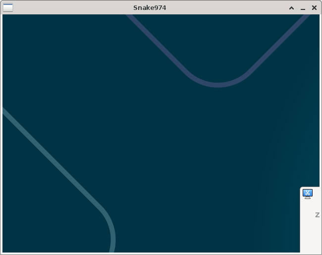
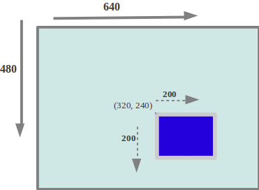
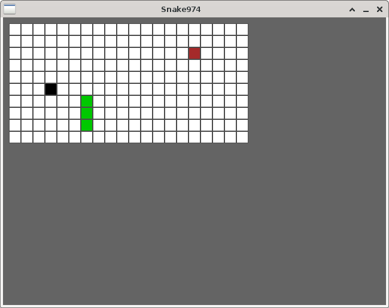
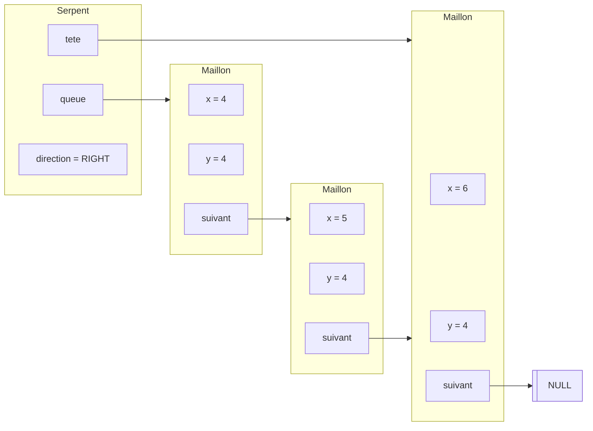

# :snake: Projet en C : jeu Snake


## 1. Installer la bibliothèque de développement

Pour réaliser le jeu, nous allons nous reposer sur une bibliothèque de développement appelée SDL (Simple DirectMedia). Nous utiliserons la version 2. Un [wiki](https://wiki.libsdl.org/SDL2) est disponible en ligne pour lire la documentation.

Cette bibliothèque fournit des fonctions permettant assez facilement de créer une fenêtre de d'y dessiner. Elle est capable d'utiliser les capacités d'accélération de la carte graphique éventuellement présente dans l'ordinateur. Elle permet également d'afficher des images, de jouer des sons, de gérer les entrées clavier, etc. Tout ce qu'il faut pour programmer un petit jeu vidéo.

Sous Linux, l'installation de la bibliothèque est très simple puisqu'elle est normalement disponible dans les paquets de votre distribution. Par exemple, pour les distributions de la famille Debian (dont Ubuntu) la commande d'installation est :
```sh
sudo apt install libsdl2-dev libsdl2-2.0-0
```

On peut également installer certains paquets optionnels comme :
```sh
sudo apt install libsdl2-image-dev libsdl2-image-2.0-0
```
pour permettre d'afficher des images.

Pour vérifier si l'installation a fonctionné, on peut par exemple exécuter la commande :
```sh
sdl2-config --version
```

## 2. Créer une fenêtre graphique

Pour nous familiariser avec SDL, nous allons commencer par créer une fenêtre graphique, attendre 5 secondes, et quitter :

!!! example "Fichier `main.c` minimal"
    ```c
    #include <SDL2/SDL.h>
    #include <stdio.h>
    #include <stdlib.h>

    int main(int argc, char * argv[]) {
        SDL_Init(SDL_INIT_VIDEO);
        SDL_Window *fenetre = SDL_CreateWindow("Snake974", 50, 50, 640, 480, 0);

        SDL_Delay(5000); // Attendre 5 sec
        SDL_DestroyWindow(fenetre);
        SDL_Quit();

        return EXIT_SUCCESS;
    }
    ```

On a inclu les fichiers d'en-tête standard et celui correspondant à la bibliothèque SDL. Nous notons que toutes les fonctions et noms concernant la bibliothèque SDL sont préfixés par `SDL_`.
 
Le programme précédent commence par initialiser SDL avec la fonction `SDL_Init`. Cette fonction a pour paramètre un entier qui représente les options d'initialisation. Pour construire cet entier, on se sert de constantes prédéfinies dans la bibliothèque appelées **drapeaux** comme `SDL_INIT_VIDEO` pour signifier qu'on veut initialiser les graphismes. Il est possible de combiner plusieurs drapeaux avec l'opérateur `|` qui est le *OU bit à bit*. Par exemple, si on veut initialiser le son et la vidéo on écrit :
```c
SDL_Init(SDL_INIT_VIDEO | SDL_INIT_AUDIO);
```

On appelle ensuite la focntion `SDL_CreateWindow` permettant de créer une **fenêtre**. Ses paramètres sont le titre de la fenêtre, sa position `(50, 50)`, ses dimensions `640x480`. Le dernier paramètre est un entier pour les options que l'on fixe encore une fois à l'aide de drapeaux. J'ai mis ici 0 pour dire que je voulais les options par défaut (aucun drapeau). 

La suite du programme est claire : on demande une attente de 5000ms puis on fait le ménage en détruisant dans le bon ordre les objets construits précédemment. En effet, on se doute bien que la fonction `SDL_CreateWindow` alloue de la mémoire sur le **tas** et qu'il est nécessaire de la libérer avec une fonction de destruction, c'est le rôle de `SDL_DestroyWindow`.
 
On peut compiler le jeu avec la commande :
```sh title="Compilation avec SDL2"
gcc main.c -o snake $(sdl2-config --cflags --libs)
```
On utilise ici l'outil `sdl2-config` qui construit automatiquement les paramètres à ajouter la ligne de compilation usuelle pour que le programme soit lié à la bibliothèque SDL.

<figure markdown="span">
{ align = center }
<figcaption> Fenêre du jeu (vide pour l'instant) </figcaption>
</figure>

## 3. La gestion des erreurs dans SDL

Les appels aux fonctions de la bibliothèque SDL peuvent provoquer des erreurs. Dans ce cas, les fonctions retournent généralement un code d'erreur (valeur non nulle) ou un pointeur `NULL` selon les cas.

Il faut donc en théorie à chaque appel de fonction de SDL, vérifier sa valeur de retour. Pour nous faciliter la vie, la bibliothèque SDL fournit la fonction `SDL_GetError()` qui retourne une chaîne de caractères décrivant l'erreur rencontrée. Voilà comment on peut adapter le code précédent :

!!! example "Illustration du traitement d'erreurs"
    ```c
    #include <SDL2/SDL.h>
    #include <stdio.h>
    #include <stdlib.h>

    int main(int argc, char * argv[]) {
        if (SDL_Init(SDL_INIT_VIDEO) != 0) {
            fprintf(stderr, "Erreur lors de l'initialisation : %s \n", SDL_GetError());
            exit(EXIT_FAILURE);
        }

        SDL_Window *fenetre = SDL_CreateWindow("Snake974", 50, 50, 640, 480, 0);
        if (fenetre == NULL) {
            fprintf(stderr, "Erreur lors de la création de la fenêtre : %s \n", SDL_GetError());
            exit(EXIT_FAILURE);
        }

        SDL_Delay(5000); // Attendre 5 sec
        SDL_DestroyWindow(fenetre);
        SDL_Quit();

        return EXIT_SUCCESS;
    }
    ```

!!! danger "Avertissement"
    **Dans toute la suite, pour me concentrer uniquement sur l'essentiel, je n'inclurai aucune autre vérification d'erreur SDL, mais cela doit faire partie du travail...**

## 3. Construire et afficher la grille du jeu

Commençons maintenant à définir à quoi ressemblera le jeu. Notre jeu sera se déroulera dans une **arene** qui est une grille rectangulaire de **blocs** carrés. On notera `ARENA_W` la largeur de l'arene en nombre de blocs, `ARENA_H` sa hauteur et `BLOCK_SIZE` la longueur du côté d'un bloc en pixels.

L'arène pourra contenir les types de bloc suivants :

- `VIDE` : bloc vide
- `WALL` : qui représente un mur
- `COCO` : qui représente une noix de coco
- `SNAKE` : qui représente une partie du corps du serpent

Cela fait de nombreuses constantes à définir, nous utilisons pour cela un fichier d'en-tête `main.h` pour déclarer les valeurs publiques (que tout le code peut du projet peut utiliser).

!!! example "Fichier `main.h`"
    ```c
    #ifndef MAIN_H
    #define MAIN_H

    // Position et dimensions de la fenetre
    #define WIN_W 640
    #define WIN_H 480
    #define WIN_X 50
    #define WIN_Y 50

    // Dimensions de l'arene 
    #define ARENA_W 20
    #define ARENA_H 10
    #define B_SIZE 20

    // Types de blocs
    #define VIDE 0
    #define WALL 1
    #define COCO 2
    #define SNAKE 4

    /* L'arene est définie comme une matrice
       de blocs */
    typedef int Arena[ARENA_W][ARENA_H];

    #endif
    ```

Il suffira ensuite d'inclure ce fichier d'en-tête dans n'importe quel fichier .c pour pouvoir utiliser ces définitions :
```c
#include "main.h"
```

!!! warning "Attention"
    Notez bien la présence de guillements "" et non de chevrons <> quand on inclus un fichier situé dans le répertoire courant.

Notez qu'on en a profité pour ajouter certains paramètres comme les dimensions de la fenêtre. Il est toujours préférable que de telles constantes n'apparaissent pas directement dans un code source afin de faciliter la lecture et la modification.

### A. Système de coordonnées

C'est le moment de faire le point sur le système de coordonnées utilisé par SDL. SDL définit la position d'un pixel $(x, y)$ ainsi :

<figure markdown="span">
{ align = center }
<figcaption> Système de coordonnées en SDL (source : Wikipedia) </figcaption>
</figure>

L'origine $(0, 0)$ est située en haut à gauche. La coordonnée $x$ représente l'abscisse du point et la coordonnée $y$ sont ordonnée, **sauf que l'axe des ordonnées est orienté vers le bas**.

!!! note
    Nous utiliserons par la suite toujours ces conventions pour parler de coordonnées. En particulier les coordonnées des blocs. Ainsi le bloc de coordonnées (0, 0) sera celui situé en haut à gauche et le bloc de coordonnées (0, 1) celui situé juste en dessous de lui.

### B. Dessin de l'arène du jeu

Pour dessiner en SDL, il est nécessaire de créer un objet appelé *renderer* qui est associé à une fenêtre et qui est en charge du dessin dans cette fenêtre.
Le renderer est construit avec la fonction `SDL_CreateRenderer` et détruit avec la fonction `SDL_DestroyRenderer`. On met à jour le code `main.c` ainsi :

!!! example "Création et destruction du renderer"
    ```c
    #include <SDL2/SDL.h>
    #include <stdio.h>
    #include <stdlib.h>

    int main(int argc, char * argv[]) {
        SDL_Init(SDL_INIT_VIDEO);
        SDL_Window *fenetre = SDL_CreateWindow("Snake974", 50, 50, 640, 480, 0);
        SDL_Renderer *renderer = SDL_CreateRenderer(fenetre, -1, SDL_RENDERER_ACCELERATED);

        SDL_Delay(5000); // Attendre 5 sec

        SDL_DestroyRenderer(renderer);
        SDL_DestroyWindow(fenetre);
        SDL_Quit();

        return EXIT_SUCCESS;
    }
    ```

Il existe ensuite une multitude de fonctions de dessin, prenant en paramètre l'instance du renderer.

| Fonction | Effet |
| :- | :- |
| `SDL_SetRenderDrawColor(renderer, r, g, b, a)` | Change la couleur de dessin $(r,g,b,a)$ |
| `SDL_RenderClear(renderer)` | Efface tout et color le fond avec la couleur actuelle |
| `SDL_RenderDrawPoint(renderer, x, y)` | Dessine un point |
| `SDL_RenderDrawLine(renderer, x1, y1, x2, y2)` | Dessine une ligne |
| `SDL_RenderDrawRect(renderer, &rect)` | Dessine un rectangle |
| `SDL_RenderFillRect(renderer, &rect)` | Remplit un rectangle |
| `SDL_RenderPresent(renderer)` | **Met à jour l'affichage** |

!!! warning "Attention"
    Noter l'importance de la fonction `SDL_RenderPresent`. Tout dessin ne sera visible qu'une fois la mise à jour de l'affichage effectué.

Notre grille étant rectangulaire, ces fonctions primitives de dessin devraient suffire. Voici quelques remarques pour bien comprendre ces fonctions :

!!! info "Les couleurs"
    En SDL les couleurs sont codées sur 4 octets, c'est-à-dire 4 valeurs entières $(r, g, b, a)$ entre 0 et 255 pour les composantes rouge (r), vert (g) et bleu (b); la composante alpha (a) représente le niveau de transparence (0 = transparent, 255 = opaque).

!!! info "Les rectangles"
    SDL implémente son propre type `SDL_Rect` pour représenter un rectangle. Voici un exemple de fonctionnement :
    ```c
    SDL_Rect rectangle = {20, 45, 100, 200}; // (x, y, width, height)
    SDL_RenderDrawRect(renderer, &rectangle);
    ```

!!! tip "Exercice : dessiner l'arène"
    Étudiez le code ci-dessous, puis compléter la fonction `draw_arena`, qui s'occupe de dessiner l'arène qu'on lui passe en paramètre. Cette fonction devra colorer chaque type de bloc avec une couleur différente. On rappelle que les blocs doivent avoir une taille de `B_SIZE` pixels.

    ```c
    #include <SDL2/SDL.h>
    #include <stdio.h>
    #include <stdlib.h>
    #include "main.h"


    /* Construit une arène entièrement vide */
    void init_arena(Arena mat) {
        for (int x = 0; x < ARENA_W; x++) {
            for (int y = 0; y < ARENA_H; y++) {
                mat[x][y] = VIDE;
            }
        }
    }
    
    void draw_arena(SDL_Renderer *renderer, Arena mat) {
        /* A VOUS DE JOUER */
    }

    int main(int argc, char * argv[]) {
        SDL_Init(SDL_INIT_VIDEO);
        SDL_Window *fenetre = SDL_CreateWindow("Snake974", WIN_X, WIN_Y, WIN_W, WIN_H, 0);
        SDL_Renderer *renderer = SDL_CreateRenderer(fenetre, -1, SDL_RENDERER_ACCELERATED);

        Arena mat;
        init_arena(mat);
        mat[3][5] = WALL; // Pour tester
        mat[6][6] = SNAKE; // Toujours pour tester
        mat[6][7] = SNAKE;
        mat[6][8] = SNAKE;
        mat[15][2] = COCO;
        draw_arena(renderer, mat);

        SDL_RenderPresent(renderer);
        
        SDL_Delay(5000); // Attendre 5 sec

        SDL_DestroyRenderer(renderer);
        SDL_DestroyWindow(fenetre);
        SDL_Quit();

        return EXIT_SUCCESS;
    }
    ```
Voilà ce que vous devriez obtenir à l'état actuel du jeu :

<figure markdown="span">
{ align = center }
<figcaption> Dessin de l'arène </figcaption>
</figure>

??? bug "Aide"
    Si vous n'y parvenez pas, pensez le problème ainsi :

    - commencez par choisir la couleur de fond puis tout effacer (clear)
    - on parcourt chaque case de la matrice `mat` on construit un `bloc` qui est un `SDL_Rect` de bonnes dimensions et placé au bon endroit
    - On remplit (fill) `bloc` avec la bonne couleur
    - On dessine (draw) `bloc` avec la couleur de contour des blocs

Bon, nous avonçons bien mais il reste encore un petit problème : il n'y a pas de murs au bord de notre grille de jeu : le serpent pourrait s'échapper. Écrivons une petite fonction pour ajouter des murs tout autour de l'arène.

!!! tip "Exercice : mur d'enceinte"
    Écrire une fonction `void mur_enceinte(Arena mat)` qui assigne la valeur `WALL` à toutes les cases sur le pourtour de la grille `mat`.

## 4. Une structure de données pour le serpent

Dans cette partie, nous allons proposer une structure de données pour gérer le serpent. Le serpent peut être implémenté sous forme d'une **liste simplement chaînée** de blocs. Cette structure permet aisément de faire évoluer le serpent lorsqu'il avance ou lorsqu'il grandit.

### A. Compilation séparée

Comme le code se complexifie, il serait bon de commencer à le **séparer** dans plusieurs fichiers. On introduit un nouveau fichier d'en-tête :

???example "Fichier `serpent.h`"
    ```c
    #ifndef SERPENT_H
    #define SERPENT_H

    #include <stdbool.h>
    #include "main.h"

    struct maillon_s {
        /* Coordonnées du bloc */
        int x;
        int y;

        /* Maillon suivant (de la queue vers la tête) */
        struct maillon_s *suivant;
    };
    typedef struct maillon_s Maillon;

    /* Sens de déplacement */
    #define RIGHT 0
    #define UP 1
    #define DOWN 2
    #define LEFT 3

    struct serpent_s {
        Maillon *queue; /* Premier maillon : fin du serpent */
        Maillon *tete; /* Dernier maillon : tête du serpent */
        int direction; /* Sens de déplacement */
    };
    typedef struct serpent_s Serpent;

    /* Coordonnées du bloc vers lequel va le serpent */
    extern int prochain_x(const Serpent *s);
    extern int prochain_y(const Serpent *s);

    /* Teste si la case est occupée par le serpent */
    extern bool appartient(const Serpent *s, int x, int y);

    /* Fait avancer le serpent */
    extern void avancer(Serpent *s);

    /* Fait grandir le serpent */
    extern void grandir(Serpent *s);

    /* Créer un serpent de longueur 1 positionné en (x, y) et
       se déplacant dans la direction dir */
    Serpent *creer_serpent(int x, int y, int dir);

    /* Marque dans l'arene mat les cases occupees par le serpent */
    extern void place_serpent(const Serpent *s, Arena mat);

    #endif
    ```

Ce fichier d'en-tête déclare les structures de données implémentant le serpent ainsi que les fonctions utiles pour le manipuler. Ces fonctions seront implémentées dans le fichier `serpent.c`, ressemblant à :

```c title="serpent.c"
#include "serpent.h"

int prochain_x(const Serpent* s) {
    /* A VOUS DE JOUER */
}
/* etc */
```

Votre projet contient maintenant 4 fichiers : `main.c`, `main.h`, `serpent.h`, `serpent.c`. Et la compilation s'obtient avec les commandes :
```sh
    gcc -c main.c $(sdl2-config --cflags)
    gcc -c serpent.c
    gcc main.o serpent.o -o snake $(sdl2-config --cflags --libs)
```
Cela devient fastidieux ! De plus à chaque modification du projet, on peut se torturer à se demander quel(s) fichier(s) doivent être recompilés ou pas et dans quel ordre...

Nous allons utiliser le logiciel `make` pour nous faciliter la tâche. Pour fonctionner, cet outil a besoin de disposer d'un fichier nommé `Makefile` à la racine de notre projet. Ce fichier décrit un ensemble de **cibles**, c'est-à-dire de fichiers à compiler, suivi de ses **dépendances** et de la commande de compilation. Écrivons ce fichier :

!!! example "Fichier `Makefile`"
    Attention, les tabulations utilisées sont importantes et doivent être de vraies tabulation (pas une succession d'espaces). Il faudra aussi adapter les valeurs de `CC`, `CFLAGS` et `LIBS` selon votre propre configuration.
    ```makefile title="Makefile"
    CC=gcc # nom du compilateur

    # Resultat de la commande sdl2-config --cflags
    CFLAGS= -I/usr/local/include -I/usr/local/include/SDL2 -D_REENTRANT -D_THREAD_SAFE

    # Resultat de la commande sdl2-config --libs
    LIBS= -L/usr/local/lib -lSDL2

    .PHONY: clean

    snake: main.o serpent.o
        $(CC) main.o serpent.o -o snake $(CFLAGS) $(LIBS)

    main.o: main.h serpent.h main.c
        $(CC) -c main.c $(CFLAGS)

    serpent.o: main.h serpent.h serpent.c
        $(CC) -c serpent.c

    clean:
        rm -f *.o
    ```

Une fois ce fichier renseigné, l'appel à la commande `make` compile automatiquement la premiere cible. Ici, la première cible est l'exécutable `snake`. En cas de modification du code, `make` est capable de savoir exactement ce qui a besoin d'être recompilé : cela évite de recompiler entièrement un projet à chaque une petite modification.

De plus nous avons ajouté une *fausse* (PHONY) cible `clean` qui fait le ménage en supprimant les fichiers intermédiaires devenus inutiles.

Résumons, désormais la commande `make` permet compiler ou recompuler tout le projet. La commande `make clean` permet de faire le ménage.

### B. Implémentation des opérations

Nous allons maintenant implémenter dans `serpent.c` les opérations décrites dans le fichier d'en-ête `serpent.h`. Rappelons les structures de données mises en jeu :
```c title="Rappel de serpent.h"
    struct maillon_s {
        /* Coordonnées du bloc */
        int x;
        int y;

        /* Maillon suivant (de la queue vers la tête) */
        struct maillon_s *suivant;
    };
    typedef struct maillon_s Maillon;

    /* Sens de déplacement */
    #define RIGHT 0
    #define UP 1
    #define DOWN 2
    #define LEFT 3

    struct serpent_s {
        Maillon *queue; /* Premier maillon : fin du serpent */
        Maillon *tete; /* Dernier maillon : tête du serpent */
        int direction; /* Sens de déplacement */
    };
    typedef struct serpent_s Serpent;
```

Voici une représentation schématique d'un serpent qui occupe les blocs de coordonnées $(4,4)$, $(5, 4)$, $(6, 4)$ et qui se déplace vers la droite. Notez bien que la liste commence avec l'élément de fin du serpent, et remonte jusque la case de tête du serpent (en dernière position dans la liste). La structure `Serpent` contient un pointeur permettant d'atteindre la tête du serpent en temps $O(1)$.



!!! tip "Exercice : Implémentation des opérations"
    Dans le fichier `serpent.c`, implémentez les opérations :
    
    1. `creer_serpent`
    2. `prochain_x` et `prochain_y`
    3. `appartient`
    4. `avancer`
    5. `grandir`
    6. `place_serpent`

    Des indications sont fournies ci-dessous.

Voici quelques indications pour vous aider dans votre tâche :

1. `creer_serpent` : il faudra allouer de la mémoire sur le tas pour la structure et pour le premier et unique maillon
2. `prochain_x` et `prochain_y` : les coordonnées de la prochaine case se calculent à partir de celles de la tête et de la direciton actuelle
3. `appartient` : c'est un parcours de liste
4. `avancer` : c'est ici que la structure proposée est vraiment intéressante : il suffit de calculer la prochaine case occupée et d'ajouter un maillon pour cet emplacement qui sera la nouvelle tête, le maillon de queue quant à lui sera supprimé (ne pas oublier de libérer la mémoire...).
5. `grandir` : même chose que l'opération précédente, mais on ne supprime pas cette fois l'élément de queue : la longueur de la liste augmente donc de 1.
6. `place_serpent` : pas de difficulté particulière, on parcourt la liste et on modifie les cases correspondantes de l'arène.

!!! warning "Remarque"
    Pour le moment on ne se préoccupe pas de savoir si les déplacements sont effectivement possibles (murs, collisions, sortie de l'arène, ...).

!!! bug "Attention"
    **Pensez bien aux cas limites de votre structure de liste !**

!!! tip "Exercice : Nettoyage"
    Ajouter une opération `destroy_serpent` dont le but est de libérer
    la mémoire allouée par un serpent. Vous ajouterez cette opération
    dans le fichier `serpent.h` en vous inspirant des autres prototypes,
    puis vous coderez l'implémentation dans `serpent.c`.


